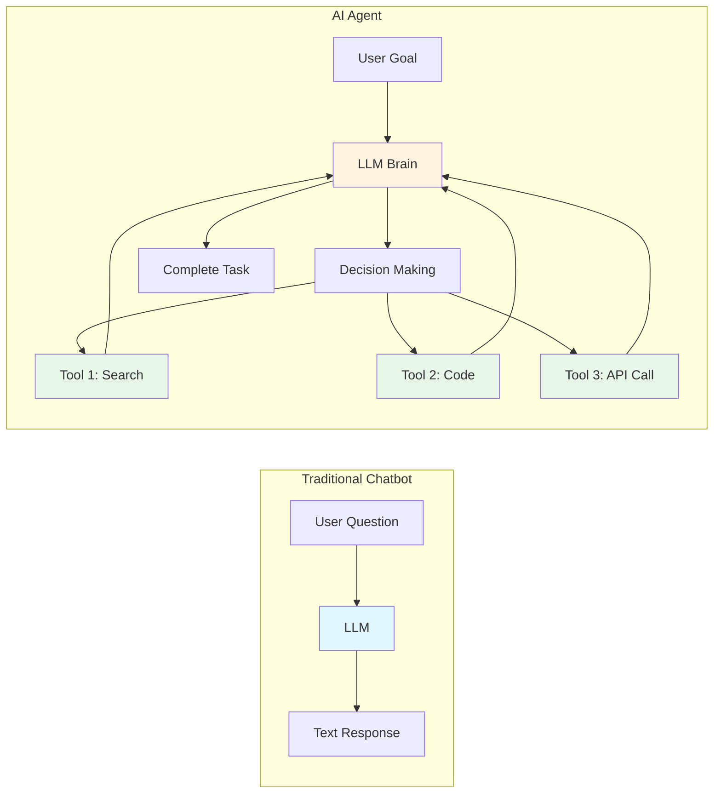
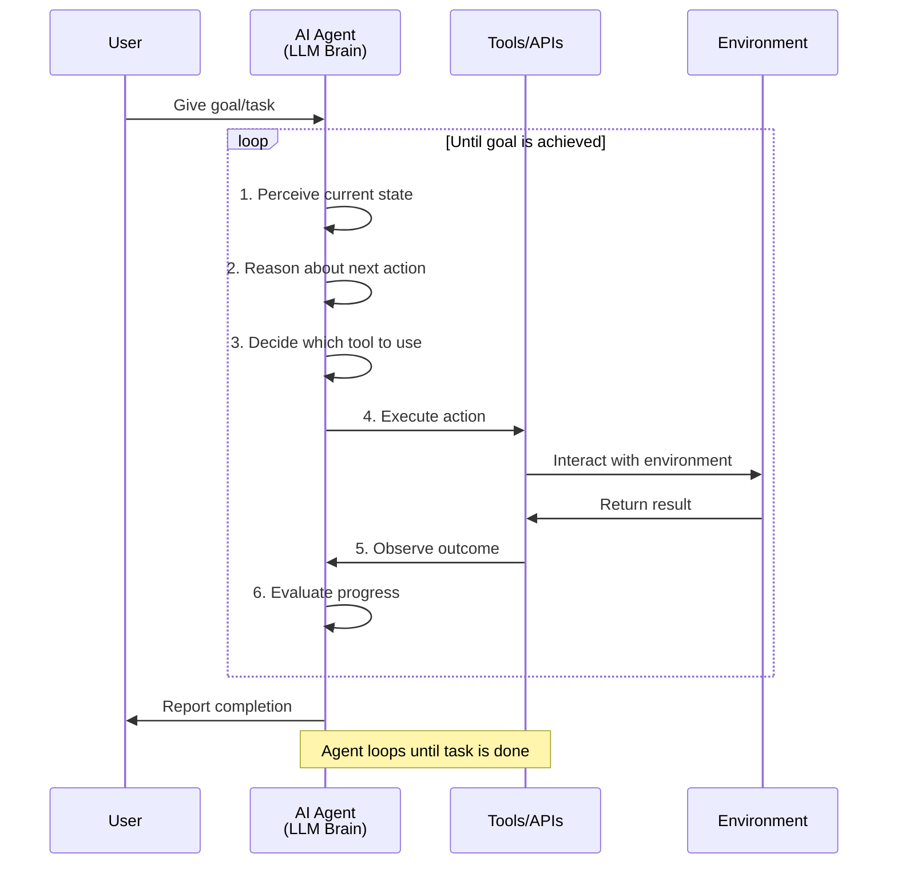
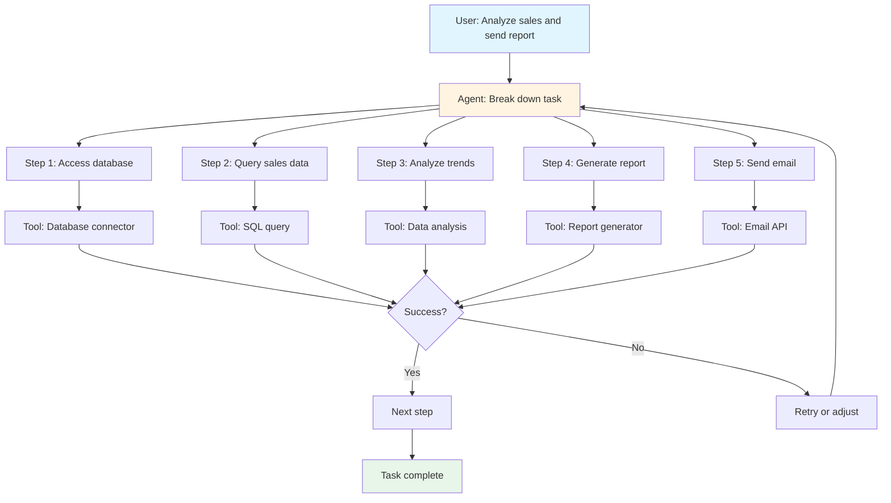

# Understanding AI Agents

## What is an AI Agent?

An **AI Agent** is an autonomous system powered by a large language model (LLM) that can:
- **Perceive** its environment and understand goals
- **Reason** about what actions to take
- **Act** by using tools and executing tasks
- **Learn** from feedback and iterate until goals are achieved

Unlike a simple chatbot that just responds to questions, an AI agent can **take action** and **work independently** to accomplish complex tasks.

## AI Agent vs. Traditional Chatbot



| Feature | Traditional Chatbot | AI Agent |
|---------|-------------------|----------|
| **Interaction** | Single Q&A | Multi-step task execution |
| **Tools** | None | Can use multiple tools |
| **Autonomy** | Passive | Active and autonomous |
| **Memory** | Limited context | Can maintain state |
| **Goal** | Answer questions | Accomplish objectives |

## How AI Agents Work



## Core Components of an AI Agent

### 1. **Brain (LLM)**
The reasoning engine that makes decisions.
- Understands natural language goals
- Plans sequences of actions
- Adapts based on feedback

### 2. **Tools**
Functions the agent can call to interact with the world.

**Examples:**
- Web search
- Code execution
- File operations
- API calls
- Database queries
- Send emails

### 3. **Memory**
Stores context and history.
- **Short-term**: Current conversation/task context
- **Long-term**: Past experiences, learned patterns

### 4. **Planning**
Ability to break down complex goals into steps.
- Create action plans
- Prioritize tasks
- Handle dependencies

### 5. **Execution Loop**
The cycle of perceive → reason → act → observe.

## Types of AI Agents

### **1. Simple Reflex Agents**
- React to current input only
- No memory or planning
- Example: Basic chatbot

### **2. Goal-Based Agents**
- Work towards specific objectives
- Plan sequences of actions
- Example: "Book me a flight to Paris"

### **3. Utility-Based Agents**
- Optimize for best outcomes
- Weigh trade-offs
- Example: "Find the cheapest flight with reasonable timing"

### **4. Learning Agents**
- Improve from experience
- Adapt strategies over time
- Example: Personal assistant that learns your preferences

## Real-World Example

**Task:** "Analyze our sales data and send a report to the team"



**Agent's thought process:**
1. "I need to access the sales database" → Uses database tool
2. "Let me query last month's data" → Executes SQL
3. "I see revenue increased 15%" → Analyzes results
4. "I'll create a summary report" → Generates document
5. "Now I'll email it to the team" → Sends email
6. "Task complete!" → Reports back to user

## Key Characteristics of AI Agents

✅ **Autonomous**: Can work independently without constant human input  
✅ **Reactive**: Responds to changes in environment  
✅ **Proactive**: Takes initiative to achieve goals  
✅ **Social**: Can interact with users and other agents  
✅ **Adaptive**: Learns and improves over time  

## AI Agents vs. MCP

**How they relate:**

- **MCP** is the **protocol/infrastructure** that connects AI agents to tools and data
- **AI Agent** is the **intelligent system** that uses MCP servers to accomplish tasks

```
AI Agent (Brain) → Uses MCP Protocol → Connects to MCP Servers (Tools) → Accesses External Systems
```

Think of it this way:
- **AI Agent** = The intelligent worker
- **MCP** = The standardized way the worker accesses tools
- **MCP Servers** = The toolbox with specific capabilities

## Common Use Cases

### **Personal Productivity**
- Schedule meetings
- Manage emails
- Research topics
- Summarize documents

### **Software Development**
- Write and debug code
- Run tests
- Deploy applications
- Review pull requests

### **Business Operations**
- Analyze data
- Generate reports
- Customer support
- Process automation

### **Research & Analysis**
- Gather information
- Synthesize findings
- Create summaries
- Answer complex questions

## Building an AI Agent

**Basic requirements:**

1. **LLM Access**: OpenAI, Anthropic, or open-source models
2. **Tool Integration**: Functions the agent can call
3. **Execution Loop**: Logic to iterate until goal is achieved
4. **Memory System**: Track context and history
5. **Error Handling**: Recover from failures

**Popular frameworks:**
- LangChain (Python/TypeScript)
- AutoGPT
- BabyAGI
- CrewAI
- Semantic Kernel (Microsoft)

## Challenges & Limitations

⚠️ **Reliability**: Agents can make mistakes or get stuck  
⚠️ **Cost**: Multiple LLM calls can be expensive  
⚠️ **Safety**: Need guardrails to prevent harmful actions  
⚠️ **Complexity**: Debugging agent behavior is difficult  
⚠️ **Hallucination**: May confidently provide incorrect information  

---

**Next Steps:**
- Learn about agent frameworks (LangChain, AutoGPT)
- Build a simple agent with basic tools
- Explore agent + MCP integration
- Study prompt engineering for agents

