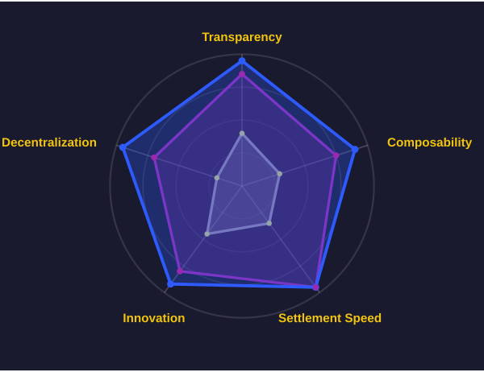
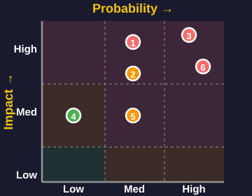

<!-- _class: lead -->

# DeFi Structured Yield Revolution
## Deep Comparison: Strata vs Pendle vs TradFi Products

<!--
[Study Notes - Page 1: Cover]

Core Concepts:
- DeFi Structured Yield Revolution: Innovation and reconstruction of traditional structured products in decentralized finance
- This presentation compares three product categories: Strata, Pendle, and TradFi structured products

Key Learning Points:
1. What are structured yield products?
2. How does DeFi transform traditional financial products?
3. What are the core differences between Strata vs Pendle?
4. What are the advantages and disadvantages of DeFi products compared to TradFi?

Background Knowledge:
- Structured products: Combining assets with different risk/return profiles to meet various investor needs
- DeFi: Decentralized Finance, blockchain-based financial services
- TradFi: Traditional Finance, centralized financial services from banks, brokers, etc.

Presentation Objective:
Understand the innovations, risks, and investment opportunities of DeFi structured products
-->

---

## Agenda

  
01

  

    
Structured Yield Products Overview

  

  
02

  

    
Strata: Risk Tranching Protocol

  

  
03

  

    
Pendle: Yield Tokenization Platform

  

  
04

  

    
TradFi Equivalent Products

  

  
05

  

    
Core Dimension Comparative Analysis

  

  
06

  

    
Risk & Opportunity Assessment

  

  
07

  

    
Future Development Trends

  

<!--
[Study Notes - Page 2: Agenda]

Presentation Structure (7 sections):

1. Structured Yield Products Overview - Basic concepts, Traditional vs DeFi comparison
2. Strata: Risk Tranching Protocol - Core mechanism, product architecture, innovations
3. Pendle: Yield Tokenization Platform - PT/YT separation, product matrix
4. TradFi Equivalent Products - Traditional structured notes, senior/junior structures
5. Core Dimension Comparative Analysis - Technology, risk, users, regulation, innovation
6. Risk & Opportunity Assessment - Market size, risk factors, investment strategies
7. Future Development Trends - Industry outlook, key insights

Learning Path:
- Sections 1-3: Understand core mechanisms of each product
- Sections 4-5: Cross-comparison, identify differences and advantages
- Sections 6-7: Practical application, investment decisions

Suggested Time Allocation:
- Overview: 3 minutes
- Product introductions: 15 minutes (5 minutes each)
- Comparative analysis: 10 minutes
- Risks & trends: 8 minutes
- Q&A: 5-10 minutes
-->

---

## What Are Structured Yield Products?

### Split/restructure yield streams from a single asset to create financial products with different risk/return profiles

Analogy: Slice yield into different portions, investors choose tiers based on risk appetite

#### Split Yield

Divide yields into multiple tiers (e.g., Senior/Junior)

#### Customize Risk

Match different risk preferences (Conservative/Aggressive)

#### Free Trading

Tokenized for instant market trading

#### Traditional Finance (TradFi)

Entry Threshold: $100K+

Pricing: Opaque black box

Liquidity: No exit during lock-up

#### DeFi Innovation

Entry Threshold: $10+

Pricing: Transparent on-chain algorithm

Liquidity: Trade & exit anytime

<!--
[Study Notes - Page 3: What Are Structured Yield Products?]

Core objective of this page:
Help audience understand "structured yield products" in 30 seconds - what they are and why they're needed.

---

Part 1: Core Definition (Most Important!)

One-sentence definition:
Structured Yield Products = Split/restructure yield streams from a single asset to create financial products with different risk/return profiles

Breaking it down:
- Single asset: e.g., 100 ETH staked, a loan, an LP position
- Yield stream: Income generated by the asset (interest, fees, rewards, etc.)
- Split/restructure: Divide yields into different portions
- Different risk/return profiles: Some stable low-yield, some volatile high-yield

Why split?
Because different investors have different needs:
- Pension funds: Want stability, avoid volatility
- Hedge funds: Want high returns, can tolerate volatility
- Individual investors: Somewhere in between

Traditional approach: One product can only meet one type of need
Structured products: One asset, split to meet multiple needs

---

Part 2: Analogy

Imagine you have a large cake (= asset yield)

Traditional approach:
- Entire cake can only be sold to one person
- Those with small needs can't afford it or can't use it all
- Those with large needs don't have enough

Structured products:
- Cut the cake into small, medium, large pieces
- Small needs buy small pieces (Senior - stable yield)
- Large needs buy large pieces (Junior - high yield)
- Everyone is satisfied, higher asset utilization

Key insight:
Through splitting, the same asset can serve more people, improving capital efficiency!

---

Part 3: Three Core Mechanisms

Mechanism 1: Split Yield
- What: Divide yields into multiple tiers
- Example:
  * 100 ETH staked, annual yield 5 ETH
  * Split into: Senior tier (4 ETH fixed) + Junior tier (1-10 ETH variable)
- Benefit: Meet different risk preferences

Mechanism 2: Customize Risk
- What: Investors choose tiers based on risk tolerance
- Choices:
  * Conservative → Senior (priority, low risk/low return)
  * Aggressive → Junior (subordinate, high risk/high return)
  * Balanced → Mixed allocation
- Benefit: Everyone finds products suited to them

Mechanism 3: Free Trading
- What: Tokenize yield rights for anytime trading
- Traditional problem: Locked for 1 year after purchase, no exit
- DeFi solution:
  * Senior Token, Junior Token tradable on DEX
  * Sell and exit anytime
  * No need to wait until maturity
- Benefit: Enhanced liquidity, reduced risk

---

Part 4: TradFi vs DeFi Comparison

Traditional Finance (TradFi) limitations:

1. High threshold: $100K+
   - Requires "accredited investor" status
   - Ordinary people cannot participate
   - Example: JPMorgan structured notes, minimum $100,000

2. Opaque pricing
   - Pricing algorithm is a black box
   - Investors don't know how it's calculated
   - Institutions may charge high hidden fees

3. Poor liquidity
   - Lock-up period 1-5 years
   - Early exit requires high penalties
   - Or simply cannot exit

DeFi innovation breakthroughs:

1. Low threshold: $10+
   - Anyone can participate
   - Minimum investment can be just a few dollars
   - True financial democratization

2. Transparent pricing
   - Smart contract code is open source
   - Pricing algorithm publicly verifiable
   - Fees clearly displayed

3. High liquidity
   - Tokenized for instant trading
   - Free trading on Uniswap and other DEXs
   - No need to wait until maturity

Key comparison data:
| Dimension | TradFi | DeFi |
|-----------|--------|------|
| Minimum Investment | $100,000 | $10 |
| Pricing Transparency | Black box | Fully transparent |
| Liquidity | Locked 1-5 years | Trade anytime |
| Access Requirements | Accredited investor | Permissionless |

---

Presentation tips:

Opening (10 sec):
"What are structured yield products? Simply put, it's slicing the asset yield cake—cutting it into different sized portions so everyone can choose the slice that suits them."

Core mechanisms (30 sec):
"It has three core mechanisms:
1. Split yield—divide into multiple tiers
2. Customize risk—match different preferences
3. Free trading—tokenized for anytime trading"

DeFi advantages (20 sec):
"Where's the DeFi innovation? Two key breakthroughs:
1. Threshold from $100K to $10—everyone can participate
2. From black box pricing to transparent algorithms—fully verifiable"

Transition to next page:
"Now that we understand the basic concepts, let's look at the four core values of DeFi structured products..."

---

Anticipated Q&A:

Q1: How does "splitting yield" actually work?
A: Through smart contract automatic distribution. For example:
- Total yield enters the contract
- Contract first pays Senior tier fixed yield
- Remaining goes entirely to Junior tier
- Fully automated, no manual intervention

Q2: Why tokenize?
A: Benefits of tokenization:
- Tradable on DEX (liquidity)
- Can be used as collateral (composability)
- Can be transferred to others (flexibility)
- Ownership clearly recorded on-chain (transparency)

Q3: How is this different from traditional bonds?
A: Similarities:
- Both are fixed income products
- Both have risk stratification

Differences:
- DeFi: Transparent, low threshold, high liquidity
- Traditional bonds: Opaque, high threshold, poor liquidity

Q4: Can ordinary people really participate?
A: Yes! You only need:
- A crypto wallet (e.g., MetaMask)
- Small amount of ETH (can start from $10)
- Basic DeFi knowledge
- No certification required

---

Key takeaways (5 keywords):

1. Split - Divide yield into different tiers
2. Customize - Match different risk preferences
3. Tokenize - Enable free trading
4. Low threshold - $10 vs $100K
5. Transparent - On-chain verifiable

One-sentence summary:
Structured yield products are "financial Lego"—decompose and reassemble yields so everyone can find an investment approach that suits them.

---

Success criteria for this page:
✅ Audience can explain structured yield products in their own words
✅ Audience understands why yield splitting is needed
✅ Audience knows DeFi's core advantages (low threshold + transparency)
✅ Audience is interested in subsequent content

If audience still doesn't understand, use this simplest example:
"Suppose you and a friend buy a house together to rent out, monthly rent $1000. You want stable income, your friend wants high returns. What to do?

Structured product solution:
- You take fixed $800/month (Senior)
- Friend takes remaining $200-2000/month (Junior, depending on occupancy rate)
- Both satisfied!

This is the essence of structured yield products."
-->

---

## Core Value Propositions

### Risk Customization

Match varying investor risk appetites

### Yield Optimization

Separate & restructure yield sources

### Enhanced Liquidity

Tokenization enables secondary markets

### Improved Transparency

On-chain verifiable mechanisms

<!--
[Study Notes - Page 4: Core Value Propositions]

Four core values of DeFi structured products:

1. Risk Customization
   - Meaning: Investors can choose different tiers based on risk tolerance
   - Examples:
     * Pension funds → Choose Senior tier (priority), capital preservation focus
     * Hedge funds → Choose Junior tier (subordinate), pursue high returns
     * Individual investors → Mixed allocation, balanced risk
   - Advantage: No longer "one size fits all," everyone finds suitable products

2. Yield Optimization
   - Meaning: Improve capital efficiency through separating and restructuring yield sources
   - Mechanism:
     * Split yield into fixed income (PT) and floating income (YT)
     * Different investors buy different parts
     * Total yield > yield from holding alone (through leverage and arbitrage)
   - Example: Pendle's PT/YT separation mechanism

3. Enhanced Liquidity
   - Meaning: Tokenize originally non-tradable yield rights, create secondary markets
   - Traditional problem: Cannot exit during lock-up after buying structured products
   - DeFi solution:
     * Tokenize yield rights (e.g., PT, YT, Senior Token)
     * Free trading on DEX
     * Exit anytime, no need to wait until maturity
   - Advantage: Improve capital efficiency, reduce liquidity risk

4. Improved Transparency
   - Meaning: All rules, pricing, fund flows are public on-chain
   - Specifics:
     * Smart contract code is open source, anyone can audit
     * Every transaction is traceable
     * Pricing algorithm is transparent, cannot be manipulated
     * Real-time view of pool status
   - Compared to TradFi: Traditional product pricing is opaque, investors are at information disadvantage

Key learning points:
- These four values are the core competitiveness of DeFi structured products
- Understand how each value addresses traditional finance pain points
- Consider: How attractive are these values to different types of investors?

Memory technique:
Risk-Yield-Liquidity-Transparency (RYLT)
-->

---

## Strata: Universal Risk Tranching Engine

<!--
[Study Notes - Page 5: Strata Product Introduction]

Core concept:
Strata = Universal risk tranching protocol that splits any yield-bearing asset into tokens with different risk levels

How it works:
1. Input: Any yield-bearing asset (e.g., stETH, aUSDC, etc.)
2. Processing: Smart contract splits into Senior (priority) and Junior (subordinate) tiers
3. Output: Two types of tokens with different risk/return profiles

Key features:
- Universality: Can tranche any DeFi yield-bearing asset
- Risk isolation: Senior tier gets priority on yield and principal; Junior tier takes more risk but gets higher returns
- Flexibility: Customizable tranching ratios and parameters

Strata's innovations:
- Not a product for specific assets, but a universal "risk tranching engine"
- Like "Lego blocks," can combine with any DeFi asset
- Brings TradFi's CDO (Collateralized Debt Obligation) concept to DeFi

Practical applications:
- Tranche stETH → Senior gets stable 4-6% APY, Junior gets leveraged 10-15% APY
- Tranche Aave deposits → Serve investors with different risk preferences

Key learning points:
- Strata's core is "risk redistribution"
- Senior and Junior are zero-sum: Junior takes risk, Senior gets protection
- Understand the waterfall distribution mechanism
-->

<!-- Strata Tranche Mechanism - CSS-based Diagram -->

<!-- Vertical Flow Layout with Waterfall -->

  <!-- Level 1: Input -->
  

    

      <h4>INPUT</h4>
      
Yield Assets

      
stETH, sUSDe

    

  

  <!-- Arrow down -->
  
↓

  <!-- Level 2: Tranching Engine -->
  

    

      <h4>TRANCHING ENGINE</h4>
      
Smart Contract

      
Split by risk

    

  

  <!-- Arrow down -->
  
↓

  <!-- Level 3: Senior + Junior side by side with output arrows -->
  

    

      

        <h4>SENIOR</h4>
        
Low Risk

        <ul>
          <li>Stable 4-6% APY</li>
          <li>Priority payment</li>
          <li>First claim</li>
        </ul>
      

      
↓

      
Senior Token

    

    

      

        <h4>JUNIOR</h4>
        
High Return

        <ul>
          <li>10-20% APY</li>
          <li>Bears first loss</li>
          <li>Residual yield</li>
        </ul>
      

      
↓

      
Junior Token

    

  

  <!-- Waterfall Legend -->
  

    Yield flows to Senior first → Junior gets remainder
  

---

## Strata Key Innovations

<!--
[Study Notes - Page 6: Strata Key Innovations]

Core objective of this page:
Showcase Strata's three key innovations compared to traditional structured products

According to Strata's official documentation (docs.strata.money), Strata is defined as:
"Strata is a generalized risk-tranching protocol that brings structured yield products to any on-chain or off-chain yield strategy by splitting yield into two tokenized risk-based tranches."

---

Strata's Three Key Innovations:

1. Perpetual Tranching

This is Strata's most core innovation!

Meaning:
Strata's yield tranching structure is perpetual, with no maturity date, operating continuously

Comparison with traditional products:
- Traditional CDO/structured notes: Have fixed maturity dates (e.g., 3 years, 5 years)
  * Must liquidate at maturity
  * Investors need to reallocate funds
  * Reinvestment risk exists
  * Liquidity restricted before maturity

- Strata perpetual tranching: No maturity date
  * Yield continuously flows to Senior and Junior
  * Investors can enter/exit anytime (depending on liquidity)
  * More like equity investment than bonds
  * Long-term holders don't worry about maturity

Technical implementation:
- Smart contracts designed for perpetual operation
- Yield distribution executed automatically every block/day
- No "maturity liquidation" logic
- Investors exit via secondary market or redemption mechanism

Advantages:
- No reinvestment risk: No need to find new products after maturity
- Continuous compounding: Yields can be continuously reinvested
- Reduced friction costs: No need to frequently migrate funds
- Better liquidity: Tokenized for anytime trading

Example:
Traditional CDO investor:
- Bought 3-year CDO in 2020
- Matured in 2023, received principal + returns
- Need to find new investment opportunities
- May face changed market conditions

Strata investor:
- Bought srUSDe (Strata Senior USDe) in 2020
- Still holding in 2023, continuously earning yield
- Still holding in 2026, no action required
- Can sell tokens anytime when wanting to exit

Significance for DeFi:
- Better aligned with DeFi's "perpetual" nature (like perpetual contracts)
- Reduces user operational complexity
- Improves capital efficiency

---

2. Over-Collateralized Senior Protection

Official description:
"Strata Senior Tranche: An over-collateralized, yield-bearing synthetic dollar... It delivers superior risk-adjusted yield by providing protection against underlying strategy and collateral risks, guaranteed minimum yield tied to the benchmark rate, and uncapped upside exposure."

Core mechanism:
Junior tier provides over-collateralization, offering multiple protections for Senior tier

Collateralization ratios:
- Typical configuration: 60-80% Senior / 20-40% Junior
- Protection multiple provided by Junior: 1.5-4x
- E.g., 80/20 configuration: Junior must lose 100% before affecting Senior

Triple protection mechanism:

Protection 1: First Loss Tranche
- All losses first deducted from Junior
- Junior acts as "buffer"
- Only when Junior is completely depleted does it affect Senior

Protection 2: Guaranteed Minimum Yield
- Senior yield linked to benchmark rate
- E.g.: Guaranteed at least 3% APY
- Even if underlying strategy underperforms, minimum protection exists

Protection 3: Uncapped Upside
- When underlying strategy performs exceptionally
- Senior can also share excess returns
- Unlike traditional fixed income products with yield caps

Specific example:
Assume Strata tranches Aave lending pool, 80/20 configuration

Scenario A: Normal operation
- Lending yield: 5% APY
- Senior receives: 4% APY (guaranteed yield)
- Junior receives: 9% APY (leverage effect)
- Both satisfied ✅

Scenario B: Market crisis, bad debt occurs
- Lending yield: 3% APY
- Bad debt loss: 2%
- Net yield: 1%
- Senior still receives: 4% APY (subsidized from Junior)
- Junior bears loss: 1% - 4% = -15% APY
- Senior protected ✅

Scenario C: DeFi Summer, yield explosion
- Lending yield: 20% APY
- Senior receives: 6% APY (shares upside)
- Junior receives: 74% APY (massive leverage)
- Senior also enjoys bull market ✅

Comparison with 2008 financial crisis CDOs:

2008 CDO problems:
- Insufficient collateral: Poor quality subprime loans
- Rating errors: AAA-rated CDOs had high actual risk
- Opaque: Investors couldn't monitor risk in real-time
- Chain collapse: Senior tiers also suffered major losses

Strata improvements:
- Over-collateralization: Visible on-chain in real-time
- No ratings needed: Smart contracts execute automatically
- Fully transparent: All data public
- Automatic protection: Triggers threshold auto-adjustment

Actual data (srUSDe example):
- Senior (srUSDe): Receives stable USDe staking yield
- Junior (jrUSDe): Provides 150-250% over-collateralization
- Protection effect: Even with 30% USDe loss, Senior remains safe

---

3. Modular, Chain-Agnostic Architecture

Official description:
"Strata is a fully on-chain protocol with a modular, chain-agnostic architecture that enables expansion beyond USDe into a broad range of USD and non-USD assets and strategies across multiple ecosystems."

Core features:
Strata is not bound to specific assets or strategies, can tranche any yield source

Supported strategy types:

1. Curated lending vaults
   - Aave, Compound and other lending protocols
   - Institutional-grade lending pools
   - Peer-to-peer lending

2. Managed multi-strategy vaults
   - Yearn Finance-style yield aggregation
   - Auto-switching between multiple protocols
   - Dynamic yield optimization

3. Exotic delta-neutral strategies
   - Hedge fund-level complex strategies
   - Market-neutral arbitrage
   - Reduced price volatility risk

4. Tokenized private credit
   - Tokenize traditional private credit
   - On-chain corporate loans
   - A form of RWA (Real World Assets)

5. High-yield RWAs
   - Real estate yields
   - Commercial paper
   - Other off-chain asset yields

Chain-agnostic deployment:
- Not limited to Ethereum mainnet
- Deployable to any EVM-compatible chain:
  * Arbitrum (low gas fees)
  * Optimism (fast confirmations)
  * Polygon (high throughput)
  * Avalanche (low latency)
  * Base, Blast and other emerging L2s

Technical implementation:
- Standardized smart contract interfaces
- Adapter Pattern
- Cross-chain bridge integration
- Unified frontend interface

Advantages of modularity:

Advantage 1: Flexibility
- Switch underlying strategies when market conditions change
- No need to redeploy entire system
- Like "Lego blocks," freely combinable

Advantage 2: Scalability
- Easily add new yield strategies
- Support future innovative protocols
- Not limited to current DeFi ecosystem

Advantage 3: Risk diversification
- Not dependent on single protocol or asset
- Can tranche multiple strategies simultaneously
- Reduces single point of failure risk

Advantage 4: Cross-chain optimization
- Deploy on low gas fee chains
- Cover users across different chains
- Improve overall capital efficiency

Practical examples:

Example 1: Expanding from USDe to other assets
- Initial: Strata tranches Ethena's USDe
- Expansion: Can tranche any stablecoin (USDC, DAI)
- Future: Can tranche volatile assets like BTC, ETH

Example 2: Cross-chain deployment
- Ethereum mainnet: For large investors (security priority)
- Arbitrum: For regular users (low cost)
- Base: For Coinbase users (ease of use)
- Same product logic, different on-chain environments

Example 3: Strategy switching
- Initial: Tranche Aave USDC lending
- Market change: Compound has higher yield
- Action: Switch to Compound
- Result: Investors automatically enjoy higher returns

Compared to traditional finance:
- TradFi structured products:
  * Bound to specific assets (e.g., a CDO can only invest in subprime loans)
  * Limited to specific jurisdictions
  * Cannot deploy across markets

- Strata:
  * Supports any asset and strategy
  * Globally borderless
  * Multi-chain deployment

---

Summary: Synergy of Three Innovations

Perpetual Tranching + Over-Collateralization + Modular Architecture =
Next-generation DeFi Structured Products

1. Perpetual Tranching: Solves the "time" problem
   - No worries about maturity and reinvestment
   - Continuous compounding, long-term growth

2. Over-Collateralization: Solves the "safety" problem
   - Multiple protection mechanisms
   - Transparent and verifiable

3. Modular Architecture: Solves the "flexibility" problem
   - Adapts to any strategy and asset
   - Cross-chain deployment, global coverage

Strata's vision:
"Bring structured yield products to any on-chain or off-chain yield strategy"

These three innovations make Strata not just a "DeFi version of CDO,"
but a completely new, safer, more flexible, more enduring yield optimization protocol.

---

Key terms:

Perpetual:
- No maturity date, runs continuously
- Similar to Perpetual Futures

Over-Collateralization:
- Collateral value > Borrowed value
- Provides safety buffer

First Loss Tranche:
- Tier that bears primary losses
- Protects other tiers

Modular:
- Pluggable component design
- Like Lego blocks

Chain-Agnostic:
- Not dependent on specific blockchain
- Can deploy on multiple chains

Benchmark Rate:
- Reference rate, like US Treasury rate
- In Strata, may be USDe's base staking yield

Uncapped Upside:
- No ceiling on returns
- Can share excess returns

---

Presentation points:

Opening (5 sec):
"Strata's three innovations make it the next-generation DeFi structured product"

Explain each (10 sec each):
1. "Perpetual Tranching - No maturity date, continuous operation, like perpetual contracts"
2. "Over-Collateralization - Junior provides multiple protections, Senior is extremely safe"
3. "Modular Architecture - Supports any yield strategy, cross-chain deployment"

Summary (5 sec):
"These three combined create a safer, more flexible, more enduring yield optimization protocol"

Transition to next page:
"Having understood Strata's innovations, let's see how Pendle solves problems from another angle..."
-->

### Perpetual Tranching

Continuous yield structure with no maturity date

### Over-Collateralization

Multiple protections for Senior tier

### Modular Architecture

Supports any yield strategy

---

## Pendle: Yield Tokenization Platform

<!--
[Study Notes - Page 7: Pendle Product Introduction]

Core concept:
Pendle = Yield tokenization protocol that separates principal and yield from yield-bearing assets into two independently tradeable tokens

PT/YT separation mechanism:
1. Input: Yield-bearing asset (e.g., stETH, aUSDC)
2. Separation:
   - PT (Principal Token) = Principal token, represents the right to redeem principal at maturity
   - YT (Yield Token) = Yield token, represents the right to all yield before maturity
3. Trading: PT and YT can be independently traded on AMM

How it works example:
Assume you have 100 stETH (5% annual yield):
- Deposit to Pendle → Receive 100 PT-stETH + 100 YT-stETH
- PT-stETH: Can redeem 100 stETH after 1 year (trades at discount, e.g., 95 ETH)
- YT-stETH: Receive all staking yield within 1 year (about 5 ETH)

Core value:
1. Fixed income: Buy PT = Lock in fixed yield (similar to bonds)
2. Yield leverage: Buy YT = Leveraged yield exposure (high risk, high return)
3. Hedging strategies: Combine PT/YT for complex strategies

Differences from Strata:
- Strata: Risk tranching (Senior vs Junior)
- Pendle: Yield separation (Principal vs Yield)
- Strata: Focuses on risk protection
- Pendle: Focuses on yield optimization

Practical use cases:
- Conservative investors: Buy PT, lock in fixed yield, like buying bonds
- Aggressive investors: Buy YT, get leveraged yield exposure
- Arbitrageurs: Profit from PT/YT price discrepancies

Key learning points:
- PT is similar to zero-coupon bond
- YT is similar to yield swap
- Understand the equation PT + YT = Original Asset
-->

  <!-- Level 1: Input -->
  

    

      <h4>INPUT</h4>
      
Yield-Bearing Assets

      
stETH, sDAI, LST

    

  

  <!-- Arrow down -->
  
↓

  <!-- Level 2: Pendle Protocol -->
  

    

      <h4>PENDLE PROTOCOL</h4>
      
Yield Tokenization

      
Separate Principal + Yield

    

  

  <!-- Arrow down -->
  
↓

  <!-- Level 3: PT + YT side by side with output arrows -->
  

    

      

        <h4>PT</h4>
        
Principal Token

        <ul>
          <li>Fixed return</li>
          <li>Trades at discount</li>
          <li>Low volatility</li>
        </ul>
      

      
↓

      
Redeem at Maturity

    

    

      

        <h4>YT</h4>
        
Yield Token

        <ul>
          <li>Floating yield</li>
          <li>Yield exposure</li>
          <li>High volatility</li>
        </ul>
      

      
↓

      
Collect Yield

    

  

  <!-- Legend -->
  

    PT + YT = Original Asset (at maturity)
  

---

## Pendle Product Matrix

<!--
[Study Notes - Page 8: Pendle Product Matrix]

Pendle's three product lines:

1. Fixed Income Products (PT)
   - Target users: Conservative investors, institutions
   - Features:
     * Lock in fixed yield, no worry about market volatility
     * Similar to traditional finance bonds
     * Redeem at face value at maturity
   - Return source: Buy discounted PT, receive face value difference at maturity
   - Risk: Interest rate risk (if market rates rise, PT price falls)
   - Example: Buy 100 PT-stETH at 95 ETH, redeem 100 ETH after 1 year, yield ≈ 5.26%

2. Leveraged Yield Products (YT)
   - Target users: Aggressive investors, traders
   - Features:
     * Leveraged yield exposure
     * High risk, high return
     * Value goes to zero at maturity (yield already distributed)
   - Return source: Receive all yield from underlying asset
   - Risk: If underlying asset yield drops, YT value shrinks significantly
   - Leverage multiple: Usually 2-5x, depends on maturity and market conditions

3. Liquidity Provision (LP)
   - Target users: Market makers, arbitrageurs
   - Features:
     * Provide liquidity for PT/YT, earn trading fees
     * Receive PENDLE token rewards
     * Bear impermanent loss risk
   - Return source:
     * Trading fees (usually 0.1-0.3%)
     * PENDLE token incentives
     * Possible protocol revenue sharing
   - Risk: Impermanent loss, smart contract risk

Portfolio strategies:
- Conservative: 80% PT + 20% LP
- Balanced: 50% PT + 30% YT + 20% LP
- Aggressive: 70% YT + 30% LP

Key learning points:
- PT and YT are complementary products for different risk preferences
- LP is the foundation of ecosystem, providing liquidity support
- Understand each product's risk/return characteristics
- Think: How to choose appropriate products based on market conditions?

Memory tips:
PT = Conservative (Principal), YT = Aggressive (Yield), LP = Market Making (Liquidity Provider)
-->

Leverage

### Boros

Leveraged yield trading

Up to 10x leverage

Spot

### V2 Spot

Spot yield trading

Fixed income access

Governance

### vePENDLE

Governance token

Yield boost system

---

## TradFi Structured Products

<!--
[Study Notes - Page 9: TradFi Structured Products]

Types of traditional finance structured products:

1. Structured Notes
   - Definition: Debt instruments issued by banks, returns linked to specific assets (stocks, indices, commodities)
   - Features:
     * Principal protection (partial or full)
     * Returns linked to underlying asset performance
     * Usually have lock-up periods (1-5 years)
   - Examples:
     * Principal-protected: 100% principal protection + 70% participation in S&P 500
     * Enhanced: 90% principal protection + 120% participation in S&P 500
   - Risks: Issuing bank credit risk, liquidity risk

2. CDO (Collateralized Debt Obligation)
   - Definition: Package debt assets (loans, bonds), tranche into different risk levels
   - Tranche structure:
     * Senior tier (AAA rated): Priority on principal and interest, low yield
     * Mezzanine tier (BBB rated): Medium risk and return
     * Equity tier (unrated): Last to receive distributions, high risk high return
   - 2008 financial crisis lessons:
     * Rating agencies failed, gave high ratings to subprime loan CDOs
     * Opaque pricing and risk assessment
     * Over-leveraging led to systemic risk
   - Comparison with Strata: Strata is a transparent on-chain version of CDO

3. Senior/Subordinate Structured Funds
   - Definition: Split fund shares into senior and subordinate tiers
   - Mechanism:
     * Senior: Fixed return (e.g., 8%), priority distribution
     * Subordinate: Residual returns, bears more risk
   - Applications: Private equity, real estate funds
   - Similarity to Strata: Both are risk-layered structures

Common features of TradFi structured products:
- ✅ Mature risk management frameworks
- ✅ Regulatory protection
- ❌ Opaque pricing
- ❌ High barriers (usually $100K+)
- ❌ Poor liquidity
- ❌ Reliance on intermediaries

Key learning points:
- TradFi structured products have decades of history, massive market size
- DeFi is reconstructing these products in a transparent, open way
- Understand TradFi's advantages (regulation, maturity) and disadvantages (opacity, high barriers)
-->

Principal Protected

### Structured Notes

• Principal protection

• Yield enhancement

• Equity-linked

Tranched

### CDO

• Tranched credit risk

• Asset-backed securities

• Re-securitization

Derivatives

### Interest Rate Derivatives

• Interest rate swaps

• Caps/Floors

• Swaptions

---

## Technical Architecture Comparison

<!--
[Study Notes - Page 10: Technical Architecture Comparison]

Technical capabilities radar chart interpretation:

This pentagon radar chart compares Strata, Pendle, and TradFi across 5 dimensions:

1. Transparency
   - Strata: 95 points - Smart contracts open source, all logic verifiable on-chain
   - Pendle: 85 points - Smart contracts open source, AMM mechanism transparent
   - TradFi: 40 points - Pricing models not public, black box operations
   - Key difference: DeFi inherently transparent, TradFi relies on trust

2. Composability
   - Strata: 90 points - Output tokens can be input for other protocols, highly modular
   - Pendle: 75 points - PT/YT composable, but relatively independent
   - TradFi: 30 points - Products closed, difficult to combine
   - Key difference: DeFi's "Lego blocks" characteristic vs TradFi's silo effect

3. Settlement Speed
   - Strata: 95 points - Real-time on-chain settlement, second-level confirmation
   - Pendle: 95 points - Real-time on-chain settlement
   - TradFi: 35 points - T+2 or longer settlement cycles
   - Key difference: Blockchain immediacy vs traditional finance delays

4. Innovation
   - Strata: 92 points - Dynamic risk adjustment, universal tranching engine
   - Pendle: 80 points - PT/YT separation mechanism, AMM innovation
   - TradFi: 45 points - Slow product innovation, regulatory constraints
   - Key difference: DeFi rapid iteration vs TradFi steady and conservative

5. Decentralization
   - Strata: 95 points - Fully decentralized, permissionless
   - Pendle: 70 points - Partially decentralized, has governance mechanisms
   - TradFi: 20 points - Highly centralized, relies on institutions
   - Key difference: Trust minimization vs trusting intermediaries

Comprehensive analysis:
- Strata and Pendle: Far surpass TradFi in transparency, composability, settlement speed, decentralization
- TradFi: Has advantages in regulatory compliance, user protection (not shown in this chart)
- Trend: DeFi technical advantages are clear, but needs improvement in regulation and user experience

Key learning points:
- Understand the meaning and importance of each dimension
- DeFi's technical advantages are disruptive
- TradFi's advantages are in regulation and maturity, not technology
- Future may be hybrid model: DeFi technology + TradFi regulation
-->

Technical Capabilities Radar

  

  

    

    Strata
  

  

    

    Pendle
  

  

    

    TradFi
  

<table class="tech-table">
<thead>
  <tr>
    <th>Dimension</th>
    <th>Strata</th>
    <th>Pendle</th>
    <th>TradFi</th>
  </tr>
</thead>
<tbody>
  <tr>
    <td>Transparency</td>
    <td class="strata-col">Fully on-chain</td>
    <td class="pendle-col">On-chain</td>
    <td class="tradfi-col">Limited</td>
  </tr>
  <tr>
    <td>Composability</td>
    <td class="strata-col">Highly composable</td>
    <td class="pendle-col">Moderately</td>
    <td class="tradfi-col">Low</td>
  </tr>
  <tr>
    <td>Settlement</td>
    <td class="strata-col">Real-time</td>
    <td class="pendle-col">Real-time</td>
    <td class="tradfi-col">T+2 or longer</td>
  </tr>
  <tr>
    <td>Innovation</td>
    <td class="strata-col">Chain-agnostic</td>
    <td class="pendle-col">AMM mechanism</td>
    <td class="tradfi-col">Traditional</td>
  </tr>
  <tr>
    <td>Decentralization</td>
    <td class="strata-col">Fully decentralized</td>
    <td class="pendle-col">Partially</td>
    <td class="tradfi-col">Centralized</td>
  </tr>
</tbody>
</table>

---

## Risk/Return Profile

<!--
[Study Notes - Page 11: Risk/Return Profile]

Risk/return comparison of three product types:

Strata Products:
1. Senior Tier
   - Expected return: 4-8% APY
   - Risk level: Low
   - Features: Priority on principal and yield, protected by Junior tier
   - Suitable for: Conservative investors, institutional capital
   - Risks: Smart contract risk, underlying asset risk (but buffered)

2. Junior Tier
   - Expected return: 12-25% APY
   - Risk level: High
   - Features: Bears first-loss risk, receives leveraged returns
   - Suitable for: Aggressive investors, high risk tolerance traders
   - Risks: May lose entire principal

Pendle Products:
1. PT (Principal Token)
   - Expected return: 3-6% fixed income
   - Risk level: Low-Medium
   - Features: Lock in fixed yield, similar to bonds
   - Suitable for: Investors seeking stable returns
   - Risks: Interest rate risk, smart contract risk

2. YT (Yield Token)
   - Expected return: 10-30% APY (high volatility)
   - Risk level: High
   - Features: Leveraged yield exposure, expires worthless
   - Suitable for: Investors bullish on underlying asset yields
   - Risks: Yield decline leads to value going to zero

3. LP (Liquidity Provision)
   - Expected return: 8-15% APY
   - Risk level: Medium
   - Features: Earn fees + token incentives
   - Suitable for: Market makers, long-term holders
   - Risks: Impermanent loss, smart contract risk

TradFi Products:
1. Structured Notes
   - Expected return: 2-8% APY
   - Risk level: Low-Medium
   - Features: Partial principal protection, returns linked to underlying
   - Suitable for: Conservative investors
   - Risks: Issuer credit risk, liquidity risk

2. CDO
   - Expected return: Senior 3-5%, Equity 15-25%
   - Risk level: Senior low, Equity high
   - Features: Tiered risk structure
   - Suitable for: Institutional investors with different risk preferences
   - Risks: Inaccurate ratings, systemic risk (2008 lesson)

Key comparisons:
- Yield: DeFi > TradFi (due to elimination of intermediary costs)
- Risk: DeFi smart contract risk vs TradFi credit risk
- Volatility: DeFi > TradFi (crypto market more volatile)
- Liquidity: DeFi > TradFi (tokenization brings liquidity)

Key learning points:
- High returns inevitably come with high risk
- Understand the risk sources of each product
- DeFi's additional risks: smart contracts, oracles, governance
- Match product selection to your risk tolerance
-->

<!-- Strata Column -->

Strata

#### Senior

Annual Yield

Benchmark+1-3%

Risk

Low

Liquidity

High

Minimum

$100

#### Junior

Annual Yield

10-30%+

Risk

High

Liquidity

High

Minimum

$500

<!-- Pendle Column -->

Pendle

#### Fixed

Annual Yield

Fixed 5-8%

Risk

Medium

Liquidity

High

Minimum

$50

#### Leveraged

Annual Yield

15-50%+

Risk

High

Liquidity

High

Minimum

$200

<!-- TradFi Column -->

TradFi

#### Notes

Annual Yield

3-6%

Risk

Low-Med

Liquidity

Low

Minimum

$25K

#### CDOs

Annual Yield

8-15%+

Risk

High

Liquidity

Low

Minimum

$100K

---

## Target User Segments

<!--
[Study Notes - Page 12: Target User Segments]

Target user comparison for three product types:

Strata Target Users:
1. DeFi Native Users
   - Profile: Familiar with smart contracts, wallet operations
   - Needs: Further optimize risk/return on top of DeFi yields
   - Typical scenario: Tranche stETH, Senior gets stable yield, Junior gets leveraged yield

2. Risk Managers
   - Profile: Need granular risk control
   - Needs: Tranche portfolios, isolate risks
   - Typical scenario: DAO treasury tranches assets, Senior for operations, Junior for growth

3. Institutional Investors
   - Profile: Large capital, need compliance and risk management
   - Needs: Find TradFi-like risk tranching tools in DeFi
   - Typical scenario: Crypto funds use Strata to build tranched products

Pendle Target Users:
1. Fixed Income Seekers
   - Profile: Risk-averse, seeking stable returns
   - Needs: Lock in fixed yields in crypto markets
   - Typical scenario: Buy PT-stETH, lock in 5% APY

2. Yield Traders
   - Profile: Bullish/bearish on future yield rates
   - Needs: Trade yield curves
   - Typical scenarios:
     * Bullish on yield increase → Buy YT
     * Bearish on yield decrease → Sell YT or buy PT

3. Arbitrageurs
   - Profile: Looking for pricing errors
   - Needs: Arbitrage PT/YT price discrepancies
   - Typical scenario: Arbitrage when PT+YT price ≠ underlying asset price

TradFi Target Users:
1. High Net Worth Individuals
   - Profile: Assets $1M+, seeking asset allocation
   - Needs: Capital preservation, tax optimization
   - Typical scenario: Buy structured notes, partial principal protection + equity participation

2. Institutional Investors
   - Profile: Pension funds, insurance companies, endowments
   - Needs: Stable returns, regulatory compliance
   - Typical scenario: Invest in AAA-rated CDO, stable cash flows

3. Corporate Treasury
   - Profile: Corporate idle fund management
   - Needs: Liquidity management, yield optimization
   - Typical scenario: Buy short-term structured products, optimize cash management

User segment comparison:
- Entry barriers:
  * Strata/Pendle: From a few dollars, no KYC
  * TradFi: $100K+, accredited investor status required
- Technical requirements:
  * Strata/Pendle: Need to understand DeFi, wallets, smart contracts
  * TradFi: Through advisors/banks, low technical requirements
- Regulatory protection:
  * Strata/Pendle: No regulatory protection, self-custody
  * TradFi: Investor protection mechanisms exist

Key learning points:
- DeFi lowers entry barriers but raises technical barriers
- Different products serve users with different risk preferences
- Understanding target users helps choose appropriate products
-->

### Strata Users

<strong>Institutional Investors</strong>

Stable yield + excess returns

<strong>DeFi Power Users</strong>

High leverage opportunities

### Pendle Users

<strong>Yield Traders</strong>

Yield arbitrage

<strong>Fixed Income Investors</strong>

Predictable cash flows

### TradFi Users

<strong>Bank Asset Managers</strong>

Compliant products

<strong>Pension Funds</strong>

Principal protection

---

## Regulatory Landscape

<!--
[Study Notes - Page 13: Regulatory Landscape Comparison]

Three dimensions of regulatory comparison:

1. Regulatory Framework

Strata/Pendle (DeFi):
- Current state: Regulatory vacuum, most countries have not yet clarified regulations
- Advantages:
  * High innovation freedom
  * Permissionless, globally accessible
  * Rapid iteration and experimentation
- Disadvantages:
  * Legal uncertainty
  * Lack of investor protection
  * May face future regulatory crackdowns
- Trends:
  * EU MiCA regulation (effective 2024)
  * US SEC increased enforcement
  * Countries gradually establishing DeFi regulatory frameworks

TradFi:
- Current state: Mature regulatory system
- Regulatory bodies:
  * US: SEC, CFTC, OCC
  * EU: ESMA, national financial regulators
  * China: CBIRC, CSRC
- Advantages:
  * Comprehensive investor protection
  * High market stability
  * Mature dispute resolution mechanisms
- Disadvantages:
  * Limited innovation
  * High compliance costs
  * High entry barriers

2. Compliance Requirements

Strata/Pendle:
- KYC/AML: Usually not required (decentralized)
- Disclosure: Smart contract code public, but no mandatory disclosure requirements
- Capital requirements: None
- Audit requirements: Voluntary smart contract audits
- Risk: May be deemed unregistered securities

TradFi:
- KYC/AML: Strictly required, must verify identity
- Disclosure: Detailed prospectus, periodic reports
- Capital requirements: Issuers must meet capital adequacy ratios
- Audit requirements: Mandatory financial audits
- Investor suitability: Must assess investor risk tolerance

3. Investor Protection

Strata/Pendle:
- Protection mechanisms:
  * Smart contract audits (non-mandatory)
  * Community governance
  * Open source code transparency
- Dispute resolution:
  * No formal mechanism
  * Relies on community consensus
  * May use on-chain governance
- Risks:
  * No compensation for smart contract vulnerabilities
  * Self-bear losses from hacks
  * No deposit insurance

TradFi:
- Protection mechanisms:
  * Deposit insurance (e.g., FDIC)
  * Investor compensation funds
  * Regulatory oversight
- Dispute resolution:
  * Court litigation
  * Arbitration mechanisms
  * Regulatory intervention
- Advantages:
  * Protection in institutional bankruptcy
  * Fraud can be prosecuted
  * Central bank backstop for systemic risk

Key insights:
- DeFi's regulatory dilemma: Decentralization vs regulatory requirements
- Future trend: Hybrid model
  * On-chain transparency + off-chain compliance
  * Decentralized technology + centralized compliance layer
  * Example: Permissioned DeFi

Key learning points:
- Regulation is not bad, it's a necessary means to protect investors
- DeFi needs to find balance between innovation and compliance
- Understanding regulatory risk is important consideration for DeFi investment
- Follow regulatory developments, may affect product availability
-->

<!-- Core comparison table -->

<table class="regulation-table">
<thead>
  <tr>
    <th>Dimension</th>
    <th class="defi-col">DeFi</th>
    <th class="tradfi-col">TRAD-FI</th>
  </tr>
</thead>
<tbody>
  <tr>
    <td>Legal Framework</td>
    <td class="defi-col">Unclear - High regulatory uncertainty</td>
    <td class="tradfi-col">Clear - Established legal system</td>
  </tr>
  <tr>
    <td>Entry Barriers</td>
    <td class="defi-col">Low - No KYC, globally accessible</td>
    <td class="tradfi-col">High - Strict qualification requirements</td>
  </tr>
  <tr>
    <td>Innovation Speed</td>
    <td class="defi-col">Fast - No approval needed, rapid iteration</td>
    <td class="tradfi-col">Slow - Lengthy approval process</td>
  </tr>
  <tr>
    <td>Investor Protection</td>
    <td class="defi-col">Weak - Self-custody, no recourse</td>
    <td class="tradfi-col">Strong - Regulatory protection, dispute resolution</td>
  </tr>
  <tr>
    <td>Compliance Cost</td>
    <td class="defi-col">Low - Tech-driven, controllable costs</td>
    <td class="tradfi-col">High - Labor-intensive, ongoing investment</td>
  </tr>
  <tr>
    <td>Transparency</td>
    <td class="defi-col">High - On-chain public, real-time</td>
    <td class="tradfi-col">Medium - Periodic disclosure, information lag</td>
  </tr>
</tbody>
</table>

<!-- Key insight -->

💡

DeFi is transitioning from "regulatory arbitrage" to "proactive compliance", forming a complementary rather than adversarial relationship with TradFi

---

## Innovation Highlights

<!--
[Study Notes - Page 14: Innovation Highlights Comparison]

Core innovation comparison of three product types:

Strata Innovation Highlights:
1. Universal Risk Tranching Engine
   - Innovation: Not targeting specific assets, but a universal tranching protocol
   - Significance: Any DeFi yield asset can be tranched
   - Analogy: Like "Uniswap for risk tranching"

2. Dynamic Risk Adjustment
   - Innovation: Automatically adjust risk parameters based on market conditions
   - Significance: More efficient than traditional fixed ratios
   - Technology: Uses oracles and algorithms for automatic rebalancing

3. Composability
   - Innovation: Output tokens can be input for other protocols
   - Significance: Creates infinite financial product combination possibilities
   - Example: Strata Senior → Aave collateral → Borrowing → Reinvestment

Pendle Innovation Highlights:
1. Yield Tokenization (PT/YT Separation)
   - Innovation: Separating principal and yield into independently tradable tokens
   - Significance: Created DeFi's "fixed income market"
   - TradFi comparison: Similar to zero-coupon bonds, but more flexible

2. AMM for Yield
   - Innovation: AMM specifically designed for yield trading
   - Technology: Pricing curve considering time decay
   - Significance: Provides liquidity and price discovery for PT/YT

3. vePENDLE Governance Model
   - Innovation: Vote-Escrowed model
   - Mechanism: Lock PENDLE → Get vePENDLE → Boosted returns + governance rights
   - Significance: Incentivizes long-term holding, reduces selling pressure

TradFi "Innovation" (relatively conservative):
1. Structured Notes
   - Features: Principal protection + market participation
   - Limitations: Complex product design, opaque
   - Issues: Risks exposed in 2008 financial crisis

2. CDO Tranching
   - Features: Tiered risk structure
   - Limitations: Ratings depend on third parties, may be inaccurate
   - Lessons: Over-securitization leads to systemic risk

3. Interest Rate Derivatives
   - Features: Hedge interest rate risk
   - Limitations: Only institutional access, retail cannot participate
   - Complexity: Requires specialized knowledge

Innovation comparison summary:

| Dimension | Strata | Pendle | TradFi |
|-----------|--------|--------|--------|
| Innovation Speed | Fast (monthly iterations) | Fast (monthly iterations) | Slow (yearly iterations) |
| Technical Innovation | High (smart contracts) | High (AMM+tokenization) | Low (traditional financial engineering) |
| Composability | Very High | High | Low |
| Transparency | Fully transparent | Fully transparent | Opaque |
| Entry Barriers | Low | Low | High |

Key insights:
- DeFi's innovation advantages:
  * Open source collaboration, fast innovation
  * Composability brings exponential innovation
  * Transparency reduces information asymmetry
- TradFi's innovation disadvantages:
  * Regulation limits innovation
  * Closed systems, difficult to combine
  * Innovation mainly serves institutions, not retail

Key learning points:
- DeFi is reconstructing traditional financial products, not simply copying
- Composability is DeFi's biggest innovation advantage
- Understanding each product's innovation helps evaluate long-term value
-->

### Strata Innovation

Universal risk tranching

Over-collateralization

Chain-agnostic design

### Pendle Innovation

Yield tokenization standard

Yield AMM

veTokenomics

### TradFi Strengths

Mature risk models

Regulatory framework

Institutional network

---

## Market Size & Growth

<!--
[Study Notes - Page 15: Market Size & Growth]

Market size comparison (2024 data):

TradFi Structured Products Market:
- Global size: ~$10-15 trillion
- Major markets:
  * US: $3-4 trillion
  * Europe: $4-5 trillion
  * Asia: $2-3 trillion
- Product type distribution:
  * Structured notes: 40%
  * CDO/CLO: 30%
  * Interest rate derivatives: 20%
  * Others: 10%
- Growth rate: 3-5% annually (mature market, slow growth)

DeFi Structured Products Market:
- Strata TVL: ~$50-100M (as of 2024)
- Pendle TVL: ~$3-5B (as of 2024, rapid growth)
- Overall DeFi structured products: ~$5-10B
- Share of total DeFi TVL: ~5-10%
- Growth rate: 50-100% annually (high growth phase)

Market size comparison analysis:
1. Absolute size:
   - TradFi is 1000-2000x DeFi
   - DeFi still in early stages
   - Massive growth potential

2. Growth speed:
   - DeFi growth rate is 10-20x TradFi
   - Significant compound growth effect
   - Expected to reach 1-5% of TradFi within 5-10 years

3. Penetration rate:
   - DeFi structured products: 5-10% of total DeFi TVL
   - TradFi structured products: Higher percentage of traditional finance
   - DeFi has significant room for penetration

Growth drivers:

DeFi growth drivers:
1. Technology maturity:
   - Layer 2 reduces gas fees
   - Improved cross-chain interoperability
   - Better user experience

2. Institutional adoption:
   - Traditional financial institutions entering DeFi
   - Regulatory frameworks gradually clarifying
   - More compliant products

3. Product innovation:
   - New yield sources (RWA, LSD, etc.)
   - More complex structured products
   - Better risk management tools

4. Market education:
   - Deeper user understanding of DeFi
   - More educational resources
   - Mature community ecosystem

TradFi growth constraints:
1. Regulatory limits: Innovation restricted
2. High costs: High intermediary fees
3. Low efficiency: Long settlement cycles
4. Entry barriers: Retail difficult to participate

Future projections (2025-2030):

Conservative projection:
- DeFi structured products TVL: $50-100B
- Annual growth rate: 30-50%
- Share of total DeFi TVL: 10-15%

Optimistic projection:
- DeFi structured products TVL: $200-500B
- Annual growth rate: 50-100%
- Share of total DeFi TVL: 15-20%
- Beginning to capture TradFi market share

Key milestones:
- 2025: Pendle TVL breaks $10B
- 2026: Mainstream institutions launch DeFi structured products
- 2027: Regulatory framework clear, compliant products explode
- 2028-2030: DeFi structured products become mainstream

Key learning points:
- DeFi market is small but growing rapidly
- Understanding growth drivers helps capture investment opportunities
- Follow TVL changes, reflects market confidence
- Long-term bullish on DeFi structured products
-->

  

    
Total Market

    
$10T

  

  

    

    

      TradFi
      $8.5T (85%)
    

  

  

    

    

      DeFi
      $150B (1.5%)
    

  

  

    

    

      Other
      $1.35T (13.5%)
    

  

Compound Annual Growth Rate (CAGR)

#### DeFi Structured Products

100%+

  Strata: 140% | Pendle: 95%

#### TradFi Structured Products

8%

  Stable but slow growth

---

## Risk Factor Analysis (1/2)

<!--
[Study Notes - Page 16: Risk Factor Analysis (1/2)]

Risk matrix interpretation:
This risk matrix evaluates 6 major risks across two dimensions:
- X-axis: Probability of occurrence (Low/Medium/High)
- Y-axis: Impact level (Low/Medium/High)

6 major risk factors explained:

1. Smart Contract Risk (High probability/High impact)
- Position: Upper right corner (red zone) - requires most attention
- Probability: High
  * Multiple smart contract vulnerabilities in DeFi history
  * 2022: $3.1B stolen (mainly smart contract vulnerabilities)
  * Complex contracts more prone to bugs
- Impact: High
  * May result in total fund loss
  * Cannot recover (blockchain irreversible)
  * No insurance compensation
- Mitigation measures:
  * Choose protocols with multiple audits
  * Review audit reports (Certik, Trail of Bits, etc.)
  * Follow bug bounty programs
  * Diversify investments, don't all-in single protocol
- Real cases:
  * 2021 Poly Network: $611M stolen (later returned)
  * 2022 Ronin Bridge: $625M stolen
  * 2023 Euler Finance: $197M stolen (partially recovered)

2. Liquidity Risk (Medium probability/High impact)
- Position: Upper middle area (orange)
- Probability: Medium
  * Liquidity dries up during market panic
  * Small pools prone to liquidity issues
- Impact: High
  * Cannot exit positions
  * Forced to accept huge slippage
  * May trigger cascading liquidations
- Mitigation measures:
  * Choose protocols with high TVL
  * Check liquidity depth
  * Avoid trading during market panic
  * Set reasonable slippage tolerance
- Real cases:
  * May 2022 UST depeg, Curve 3pool liquidity dried up
  * March 2023 USDC depeg, multiple DeFi protocols liquidity crisis

3. Oracle Risk (Medium probability/High impact)
- Position: Upper middle area (orange)
- Probability: Medium
  * Oracle manipulation
  * Data source failure
  * Network latency causing price deviation
- Impact: High
  * Incorrect pricing leads to arbitrage losses
  * Unfair liquidations
  * Protocol fund losses
- Mitigation measures:
  * Use multiple oracles (Chainlink, Band, etc.)
  * Check oracle update frequency
  * Monitor oracle decentralization level
- Real cases:
  * Nov 2020 Compound liquidation event (Coinbase oracle failure)
  * 2022 Mango Markets manipulation ($110M loss)

Key learning points:
- Upper right corner risks (high probability + high impact) require priority attention
- Smart contract risk is DeFi's biggest risk
- Understand mitigation measures for each risk
- Risk management is more important than chasing high returns
-->

<!-- Left: Risk Matrix Chart -->

Risk Matrix

<!-- Right: Risk Details Table -->

Smart Contract Risk Details

<table class="risk-table">
<thead>
  <tr>
    <th>Risk Type</th>
    <th>Probability</th>
    <th>Impact</th>
    <th>Priority</th>
  </tr>
</thead>
<tbody>
  <tr>
    <td>1. Strata Contract Vuln.</td>
    <td>Med</td>
    <td>High</td>
    <td class="priority-high">High</td>
  </tr>
  <tr>
    <td>2. Pendle AMM Vuln.</td>
    <td>Med</td>
    <td>Med-High</td>
    <td class="priority-medium">Med</td>
  </tr>
  <tr>
    <td>3. Oracle Attack</td>
    <td>Med-High</td>
    <td>High</td>
    <td class="priority-high">High</td>
  </tr>
  <tr>
    <td>4. Governance Attack</td>
    <td>Low</td>
    <td>Med</td>
    <td class="priority-low">Low</td>
  </tr>
  <tr>
    <td>5. Liquidity Risk</td>
    <td>Med</td>
    <td>Med</td>
    <td class="priority-medium">Med</td>
  </tr>
  <tr>
    <td>6. Regulatory Risk</td>
    <td>High</td>
    <td>Med-High</td>
    <td class="priority-high">High</td>
  </tr>
</tbody>
</table>

---

## Risk Factor Analysis (2/2)

### Market Risk

<!--
[Study Notes - Page 17: Risk Factor Analysis (2/2)]

Continued analysis of remaining 3 major risks:

4. Regulatory Risk (Medium probability/Medium impact)
- Position: Center area (yellow)
- Probability: Medium
  * Uncertain regulatory policies across countries
  * SEC's tough stance on DeFi
  * May suddenly introduce restrictive policies
- Impact: Medium
  * May lead to protocol closure or restricted access
  * Token price volatility
  * But won't directly cause fund loss (can exit early)
- Specific risks:
  * Protocol deemed unregistered securities
  * Team members prosecuted
  * Geographic restrictions (IP blocking)
  * Tax compliance requirements
- Mitigation measures:
  * Follow regulatory developments
  * Choose highly decentralized protocols
  * Maintain proper tax records
  * Diversify across multiple jurisdictions
- Real cases:
  * 2023 Tornado Cash sanctioned
  * 2023 Binance SEC settlement
  * EU MiCA regulation effective 2024

5. Market Volatility Risk (High probability/Medium impact)
- Position: Right center area (yellow)
- Probability: High
  * Crypto market extremely volatile
  * Frequent 50%+ corrections
  * Heavily influenced by macro economy
- Impact: Medium
  * Asset value fluctuates significantly
  * May trigger liquidations
  * But won't go to zero (except extreme cases)
- Specific manifestations:
  * Underlying asset price volatility
  * Yield rate changes dramatically
  * PT/YT prices swing wildly
- Mitigation measures:
  * Use stablecoin products
  * Set stop-losses
  * Don't over-leverage
  * Hold long-term, don't chase pumps/dumps
- Real cases:
  * 2022 bear market: ETH from $4800 to $880 (-82%)
  * March 2023 USDC depeg event
  * 2024 post-ETF approval volatility

6. Operational Risk (Low probability/Medium impact)
- Position: Left center area (green) - relatively safe
- Probability: Low
  * Mainly user operational errors
  * Can be avoided through learning
- Impact: Medium
  * May lose partial funds
  * But usually not total loss
- Specific risks:
  * Sending to wrong address (unrecoverable)
  * Signing malicious transactions
  * Private key leak
  * Phishing websites
  * Excessive approvals
- Mitigation measures:
  * Use hardware wallet
  * Carefully verify addresses
  * Don't click suspicious links
  * Regularly check approvals (Revoke.cash)
  * Small test before large transfers
- Real cases:
  * Users mistakenly send assets to contract addresses
  * Signing malicious approvals leads to theft
  * Private key leak leads to wallet drain

Risk Management Strategies:

1. Diversification
- Don't put all funds in single protocol
- Suggestion: Single protocol no more than 20% of total assets

2. Risk Tiering
- High-risk funds: 10-20% (Junior, YT, etc.)
- Medium-risk funds: 30-40% (LP, balanced products)
- Low-risk funds: 40-60% (Senior, PT, stablecoins)

3. Continuous Monitoring
- Regularly check protocol TVL changes
- Follow audit report updates
- Track community discussions
- Set price alerts

4. Contingency Plan
- Prepare quick exit strategy
- Understand emergency withdrawal process
- Keep portion of liquid funds

Key learning points:
- No zero-risk investment, only risk management
- Understand characteristics and mitigation for each risk
- Allocate assets according to your risk tolerance
- Continuously learn and monitor risk dynamics
-->

#### Liquidity Drain

DeFi Medium Risk

Insufficient liquidity in extreme markets

#### Underlying Asset Volatility

DeFi High Risk

Crypto asset price volatility

#### Bank Run Risk

DeFi Med-High Risk

Mass redemptions cause system stress

---

## Investment Strategy Recommendations

<!--
[Study Notes - Page 18: Investment Strategy Recommendations]

Investment strategies based on risk preference:

1. Conservative Investor Strategy

Goal: Capital preservation, stable returns
Risk tolerance: Low, max drawdown <5%
Expected returns: 4-6% APY

Asset allocation:
- Strata Senior 40%
  * Priority protection, lowest risk
  * Expected returns: 4-6% APY
  * Suitable for: Pension funds, conservative investors

- Pendle PT 30%
  * Lock in fixed returns
  * Expected returns: 3-5% APY
  * Suitable for: Seeking stable cash flows

- TradFi Structured Notes 20%
  * Principal protected products
  * Expected returns: 2-4% APY
  * Suitable for: Risk diversification, compliance

- Cash/Stablecoins 10%
  * Liquidity reserve
  * Emergency funds
  * Opportunity fund (buy dips during panic)

Operational advice:
- Hold long-term, don't trade frequently
- Regularly check protocol security
- Avoid using leverage
- Diversify across 3-5 protocols

Risk warning:
- Even conservative strategy has smart contract risk
- Consider DeFi insurance (e.g., Nexus Mutual)
- Don't invest more than 30% of total assets in DeFi

---

2. Balanced Investor Strategy

Goal: Balance risk and returns
Risk tolerance: Medium, max drawdown 10-15%
Expected returns: 8-12% APY

Asset allocation:
- Strata Senior 30%
  * Stable yield foundation
  * Expected returns: 4-6% APY

- Pendle PT 25%
  * Fixed income portion
  * Expected returns: 3-5% APY

- Strata Junior 20%
  * Enhanced returns
  * Expected returns: 12-18% APY
  * Assumes some risk

- Pendle YT 15%
  * Leveraged yield exposure
  * Expected returns: 15-25% APY
  * High risk, high reward

- Cash Reserve 10%
  * Liquidity management
  * Rebalancing funds

Operational advice:
- Rebalance quarterly
- Adjust allocation based on market conditions
  * Bull market: Increase Junior/YT proportion
  * Bear market: Increase Senior/PT proportion
- Use portion of returns to buy DeFi insurance
- Watch for new yield opportunities

Rebalancing strategy:
- Rebalance when any asset deviates ±5% from target
- Example: Junior rises from 20% to 26%, sell some to Senior

Risk management:
- Set stop-loss: Consider exit when Junior/YT drops 20%
- Diversify across 5-8 protocols
- Regularly check audit reports

---

3. Aggressive Investor Strategy (not shown on slide, but important)

Goal: Pursue high returns
Risk tolerance: High, can handle 30%+ drawdown
Expected returns: 15-30% APY

Asset allocation:
- Strata Junior 40%
  * Leveraged yields
  * Expected returns: 15-25% APY

- Pendle YT 30%
  * Yield rate trading
  * Expected returns: 20-40% APY

- LP Liquidity Provision 20%
  * Fees + incentives
  * Expected returns: 10-20% APY

- Cash Reserve 10%
  * Dip buying fund

Operational advice:
- Active trading, capture market opportunities
- Use leverage (cautiously)
- Monitor yield curve changes
- Quick stop-loss

Risk warning:
- May lose most of principal
- Requires professional knowledge and experience
- Not suitable for beginners
- Only use money you can afford to lose

---

Universal Investment Principles:

1. Diversification
- Don't all-in single protocol
- Spread across multiple product types
- Spread across multiple blockchains

2. Continuous Learning
- Understand product mechanics
- Follow protocol updates
- Learn risk management

3. Long-term Perspective
- Don't be affected by short-term volatility
- Power of compound interest
- Patiently wait for opportunities

4. Risk Management
- Only invest in products you understand
- Set stop-losses
- Regularly check and rebalance

Key learning points:
- Choose strategy based on your risk tolerance
- No "best" strategy, only "most suitable" strategy
- Adjust strategy when market conditions change
- Risk management more important than chasing high returns
-->

### Conservative Investor

  Strata Senior
  40%

  Pendle Fixed
  30%

  TradFi Notes
  20%

  Cash/Stablecoins
  10%

  
Expected Return

  
4-6%

  
Max Drawdown

  
&lt;5%

### Balanced Investor

  Strata Senior
  30%

  Pendle Fixed
  25%

  Strata Junior
  20%

  Pendle Leveraged
  15%

  Cash Reserve
  10%

  
Expected Return

  
8-12%

  
Max Drawdown

  
10-15%

---

## Future Development Trends

<!--
[Study Notes - Page 19: Future Development Trends]
(Updated: March 2026)

Industry landscape as of 2026:

1. RWA Integration - NOW MATURING

Current state (2026):
- Tokenized US Treasuries: $15B+ on-chain (Ondo, Backed, OpenEden)
- Real estate tokenization gaining traction (RealT, Landshare)
- Structured products combining RWA yields with DeFi tranching

Achievements since 2024:
- Regulatory clarity in EU (MiCA), Singapore, UAE
- Major custodians offering tokenized asset services
- Integration with Pendle/Strata-style protocols

Next steps (2027+):
- Corporate bond tokenization at scale
- Cross-border RWA settlement
- Institutional-grade RWA structured products

---

2. Cross-chain Interoperability - ESTABLISHED

Current state (2026):
- LayerZero, Wormhole, Chainlink CCIP widely adopted
- Unified liquidity pools across L2s
- Cross-chain PT/YT trading standard

What was achieved (2024-2025):
- Major bridge security improvements post-2022 exploits
- Native cross-chain structured product deployment
- Gas optimization via L2 aggregation

---

3. AI-Driven Risk Management - NOW ACTIVE

Current state (2026):
- AI agents managing yield optimization strategies
- Real-time risk parameter adjustment
- Predictive analytics for yield curve modeling

Key deployments:
- AI-powered robo-advisors for DeFi yield products
- Automated Senior/Junior ratio rebalancing
- On-chain ML models for credit scoring

Next frontier (2027+):
- Autonomous protocol governance
- AI-generated structured product design
- Personalized risk profiling at scale

---

4. Regulatory Compliant Products - FRAMEWORK EMERGING

Current state (2026):
- MiCA in effect in EU (since Jan 2025)
- Singapore MAS licensed DeFi products
- US still evolving but clearer guidance emerging

Compliant DeFi models now live:
- Permissioned pools with KYC (Aave Arc successors)
- Hybrid on-chain/off-chain compliance layers
- Institutional DeFi platforms (Fireblocks, Anchorage integrations)

---

5. Complex Structured Products - GROWING

Current state (2026):
- Multi-layer tranching (Senior/Mezzanine/Junior) available
- Conditional trigger products in production
- Strata + Pendle combo products emerging

Innovations deployed:
- Embedded options in yield products
- Principal-protected DeFi vaults
- Dynamic yield allocation based on market conditions

---

Market Status (as of Q1 2026):

2024-2025 (COMPLETED):
✓ Cross-chain infrastructure matured
✓ Initial RWA integration successful
✓ AI tools began deployment
✓ MiCA and regional frameworks enacted

2026 (CURRENT):
→ Institutional adoption accelerating
→ DeFi structured product TVL: ~$45B
→ AI-driven strategies becoming standard
→ RWA-DeFi convergence underway

2027+ (PROJECTED):
- TVL target: $100B+
- Full TradFi-DeFi product parity
- Mainstream retail access via compliant rails
- Quantum-safe cryptography integration begins

Key insights:
- DeFi structured products have moved past early stage
- Institutional participation is now real, not theoretical
- Regulatory clarity is enabling, not hindering, growth
- AI and RWA are the current growth drivers
-->

#### 2024-25
Foundation

• Cross-chain matured

• RWA protocols launched

• Basic AI tools emerged

#### 2026
Current State

• AI-driven strategies

• RWA-DeFi integration

• Regulatory frameworks

#### 2027
Institutional Wave

• Major TradFi adoption

• Compliant DeFi products

• $100B+ TVL target

#### 2028+
Mainstream

• Full TradFi convergence

• Quantum-safe protocols

• Global retail access

### Current Innovation Focus (2026)
1. AI-Powered Risk Engines: Real-time dynamic yield optimization
2. RWA Structured Products: Tokenized treasuries & real estate tranching
3. Compliant DeFi Rails: MiCA-ready, institutional-grade infrastructure

---

## Summary: Key Insights

<!--
[Study Notes - Page 20: Summary Key Insights]

Summary of core points from the presentation:

1. Technology Advantage is in DeFi

Core argument:
DeFi far surpasses TradFi in transparency, composability, and innovation speed

Specific manifestations:
- Transparency:
  * Smart contract code is open source
  * All transactions viewable on-chain
  * Pricing algorithms public
  * vs TradFi's black box operations

- Composability:
  * Strata output can be Pendle input
  * Infinite combination possibilities
  * "Financial Legos"
  * vs TradFi's closed systems

- Innovation speed:
  * Monthly iterations vs yearly iterations
  * Permissionless innovation
  * Community-driven
  * vs TradFi's regulatory constraints

Data support:
- Tech radar chart: DeFi leads in 4 of 5 dimensions
- Strata/Pendle transparency 95 vs TradFi 40
- DeFi innovation speed is 10-20x TradFi

Key learning points:
- DeFi's technical advantages are structural, not temporary
- These advantages will persist long-term
- Investing in DeFi is investing in technological progress

---

2. Regulatory Advantage is in TradFi

Core argument:
TradFi has clear advantages in regulatory certainty and investor protection

Specific manifestations:
- Regulatory certainty:
  * Mature legal framework
  * Clear compliance requirements
  * Predictable regulatory environment
  * vs DeFi's regulatory vacuum

- Investor protection:
  * Deposit insurance (FDIC)
  * Investor compensation funds
  * Regulatory oversight
  * Legal recourse mechanisms
  * vs DeFi's "at your own risk"

- Institutional trust:
  * Decades of operational history
  * Brand reputation
  * Central bank backstop for systemic risk
  * vs DeFi's emerging nature

Risk comparison:
- TradFi: Credit risk, operational risk
- DeFi: Smart contract risk, regulatory risk

Key learning points:
- Regulation isn't bad, it's necessary to protect investors
- DeFi needs to find balance between innovation and compliance
- Future may be hybrid: DeFi technology + TradFi regulation

---

3. Convergence is the Future

Core argument:
The biggest opportunity is in DeFi-TradFi convergence, not opposition

Convergence directions:

a) RWA (Real World Assets) Integration
- Tokenize traditional assets
- Trade in DeFi
- Examples:
  * Treasury tokenization → Pendle yield separation
  * Real estate tokenization → Strata risk tranching
  * Corporate bonds → DeFi liquidity pools

b) Hybrid Products
- DeFi technology + TradFi assets
- On-chain transparency + off-chain compliance
- Examples:
  * Permissioned DeFi
  * Compliant stablecoin yield products
  * Institutional DeFi infrastructure

c) RegTech
- Using blockchain to meet regulatory requirements
- Automated compliance reporting
- On-chain KYC/AML verification

Market opportunity:
- RWA market size: Trillions of dollars
- Bridge for institutional capital into DeFi
- New yield sources

Timeline:
- 2024-2025: Initial RWA implementation
- 2026-2027: Hybrid products mature
- 2028-2030: Deep integration

Key learning points:
- Don't view DeFi and TradFi as adversaries
- Convergence is the biggest opportunity
- Follow RWA sector development

---

4. Risk Must Be Managed

Core argument:
Smart contract risk is DeFi's biggest challenge, must be taken seriously

Risk hierarchy:
1. Smart Contract Risk (highest priority)
   - Can cause total loss of funds
   - Cannot be recovered
   - Need: Audits, diversification, insurance

2. Liquidity Risk (high priority)
   - May not be able to exit
   - Need: Choose high TVL protocols

3. Market Volatility Risk (medium priority)
   - Asset value fluctuations
   - Need: Long-term holding, avoid excessive leverage

4. Regulatory Risk (medium priority)
   - Policy uncertainty
   - Need: Follow developments, diversify jurisdictions

Risk management framework:
- Diversify: No more than 20% in single protocol
- Risk grading: High/medium/low risk asset allocation
- Continuous monitoring: Regularly check audits, TVL
- Contingency plan: Prepare quick exit strategy

Insurance options:
- Nexus Mutual
- InsurAce
- Unslashed Finance

Key learning points:
- High returns inevitably come with high risks
- Risk management more important than chasing returns
- Never invest money you can't afford to lose
- Continuous learning and vigilance

---

Strategic Recommendations (3 time horizons):

Short-term (6-12 months): Learn and pilot
- Goal: Understand product mechanics, small-scale testing
- Actions:
  1. Deep dive into Strata, Pendle mechanics
  2. Small investment ($100-1000), experience products
  3. Establish risk assessment framework
  4. Follow audit reports and community discussions
- Capital allocation: 5-10% of total assets
- Expected outcome: Gain experience, avoid major losses

Medium-term (1-3 years): Increase allocation, develop hybrid products
- Goal: Expand DeFi investment, participate in RWA opportunities
- Actions:
  1. Increase DeFi structured products to 20-30%
  2. Follow RWA projects (e.g., Ondo, Maple)
  3. Participate in liquidity provision, earn extra returns
  4. Consider DeFi insurance
- Capital allocation: 20-30% of total assets
- Expected outcome: Stable returns, capture RWA opportunities

Long-term (3-5 years): Build complete product matrix, achieve convergence
- Goal: DeFi becomes significant part of portfolio
- Actions:
  1. Build diversified DeFi portfolio
  2. Participate in governance, influence protocol development
  3. Follow regulatory compliant products
  4. Consider institutional DeFi products
- Capital allocation: 30-50% of total assets
- Expected outcome: DeFi becomes mainstream, long-term compound returns

---

Final Summary:

DeFi structured products value proposition:
✅ Clear technology advantages (transparent, composable, fast innovation)
✅ Lower entry barriers (from $100K to $10)
✅ Improved capital efficiency (tokenization, liquidity)
✅ Create new yield opportunities

Challenges:
⚠️ Smart contract risk
⚠️ Regulatory uncertainty
⚠️ User experience barriers
⚠️ Market volatility

Investment advice:
1. Long-term bullish on DeFi structured products
2. Short-term caution, small-scale testing
3. Prioritize risk management
4. Follow RWA and regulatory compliant products
5. Continuous learning, stay vigilant

Remember:
- This is a high-risk, high-reward emerging field
- Only invest in products you understand
- Only invest money you can afford to lose
- Risk management always comes first

Key learning points:
- These 4 insights are the essence of the presentation
- Understand the balance between tech advantages and regulatory challenges
- Convergence is the future, not opposition
- Risk management is the key to success
-->

#### Tech Advantage in DeFi

Leading in transparency, composability, innovation speed

#### Regulatory Advantage in TradFi

Strong regulatory certainty, investor protection

#### Convergence is the Future

Biggest opportunity in hybrid products

#### Risk Must Be Managed

Smart contract risk is the biggest challenge

### Strategic Recommendations
1. **Short-term (6-12mo):** Pilot with small allocations, build evaluation framework
2. **Medium-term (1-3yr):** Scale DeFi exposure, explore hybrid RWA products
3. **Long-term (3-5yr):** Full portfolio integration, achieve TradFi-DeFi convergence

---

## Questions & Discussion

<!--
[Study Notes - Page 21: Questions & Discussion]

Purpose of this page:
- Guide audience questions
- Present common Q&A
- Deepen understanding of key concepts
- Facilitate interactive discussion

6 common questions and detailed answers:

1. Technical Question: How is smart contract security ensured?

Background:
This is the most frequently asked question, as smart contract vulnerabilities are DeFi's biggest risk.

Standard answer:
- Multiple audits:
  * Both Strata and Pendle audited by top audit firms
  * Auditors: Certik, Trail of Bits, OpenZeppelin, etc.
  * Re-audited after each major update

- Bug Bounty programs:
  * High rewards attract white hat hackers
  * Hosted on Immunefi platform
  * Up to $1M rewards

- Timelock and multisig:
  * Critical operations have 24-48 hour timelock
  * Multisig wallets control key parameters
  * Community can monitor

- Formal verification:
  * Mathematical proofs of code correctness
  * Critical modules formally verified

Additional notes:
- Even with these measures, 100% security cannot be guaranteed
- Recommend DeFi insurance as additional protection
- Diversify, don't all-in on single protocol

---

2. Regulatory Question: Are DeFi products legal?

Background:
Regulatory uncertainty is one of investors' biggest concerns.

Standard answer:
- Current state:
  * Most countries have not enacted clear legislation
  * In regulatory gray area
  * Different jurisdictions have different attitudes

- USA:
  * SEC takes hard stance, considers some DeFi tokens securities
  * CFTC considers crypto as commodities
  * Regulatory framework in development

- EU:
  * MiCA regulation effective 2024
  * Relatively friendly and clear
  * Provides compliance path for DeFi

- Asia:
  * Singapore, Hong Kong relatively open
  * Mainland China banned
  * Japan has clear licensing system

Investment advice:
- Follow regulatory developments
- Choose compliance-conscious protocols
- Keep tax records
- Consider using VPN and decentralized frontends

---

3. Investment Question: How should regular investors start?

Background:
New investors often don't know where to begin.

Standard answer - 5-step method:

Step 1: Learn basics (1-2 weeks)
- Understand blockchain, DeFi fundamentals
- Learn wallet usage (MetaMask, etc.)
- Understand gas fees, transaction confirmations
- Recommended resources:
  * Binance Academy
  * CoinGecko Learn
  * YouTube tutorials

Step 2: Prepare tools (1 week)
- Install MetaMask wallet
- Buy small amount of ETH (for gas)
- Understand DEXs (like Uniswap)
- Learn to use block explorers

Step 3: Small-scale testing ($100-500)
- Choose 1-2 protocols
- Invest in conservative products (Senior, PT)
- Experience complete process
- Record all operations

Step 4: Risk assessment (ongoing)
- Check audit reports
- Review TVL and user count
- Follow community discussions
- Set price alerts

Step 5: Gradually expand (after 3-6 months)
- Adjust strategy based on experience
- Increase investment amounts
- Try different products
- Build portfolio

Key principles:
- Only invest in products you understand
- Only invest money you can afford to lose
- Start small
- Continuous learning

---

4. Product Question: What's the difference between Strata and Pendle?

Background:
Many people confuse the functions of these two products.

Standard answer - Core differences:

Strata: Risk Tranching Engine
- Function: Separates risk into Senior/Junior
- Analogy: Like mortgage priority/subordinated debt
- Suitable for: Investors with different risk preferences
- Yield source: Redistribution of underlying asset returns
- Key innovation: Dynamic risk adjustment

Pendle: Yield Tokenization Platform
- Function: Separates yield into PT/YT
- Analogy: Like separating bond principal and interest
- Suitable for: Investors with different yield expectations
- Yield source: Yield rate trading
- Key innovation: Yield marketplace

Can be used together:
- First use Strata for tranching
- Then use Pendle for yield separation
- Create more complex products

Memory tip:
- Strata = Separate risk (vertical layers)
- Pendle = Separate yield (present/future)

---

5. Yield Question: Why are DeFi yields so high?

Background:
Many question the sustainability of high yields.

Standard answer - Yield source analysis:

Legitimate yield sources:
1. Protocol real revenue:
   - Trading fees
   - Lending interest
   - Liquidation penalties
   - These are sustainable

2. Improved capital efficiency:
   - Remove intermediaries
   - Automation reduces costs
   - 24/7 operation
   - Global liquidity pools

3. Early growth dividends:
   - Market still growing rapidly
   - Competition not yet full
   - Many efficiency arbitrage opportunities

Unsustainable yield sources (beware):
1. Token incentives:
   - Protocol distributes governance tokens
   - Token price drops affect yields
   - Incentives may end

2. Ponzi structures:
   - New money pays old yields
   - Unsustainable
   - Need to be cautious (e.g., Terra/Luna)

Evaluation methods:
- Check protocol real revenue
- Understand yield composition
- Be cautious of excessive yields (>50% APY needs scrutiny)
- Monitor TVL trends

Reasonable expectations:
- Stablecoin products: 3-8% APY
- Risk-tranched products: 5-15% APY
- High-risk products: 15-30% APY
- Over 30% requires extra caution

---

6. Risk Question: What's the worst case scenario?

Background:
Investors need to understand maximum risk.

Standard answer - Worst case analysis:

Scenario 1: Smart contract hack
- Probability: Medium (has happened multiple times historically)
- Consequence: Total loss of funds
- Mitigation: Audits, insurance, diversification
- Historical case: Poly Network $611M

Scenario 2: Protocol shut down by regulators
- Probability: Medium
- Consequence: Cannot access, but funds may be withdrawable
- Mitigation: Monitor regulation, use decentralized frontends
- Historical case: Tornado Cash

Scenario 3: Extreme market volatility
- Probability: High (common in crypto markets)
- Consequence: Significant asset value decline, possible liquidation
- Mitigation: Avoid excessive leverage, hold long-term
- Historical case: 2022 bear market ETH -82%

Scenario 4: Liquidity exhaustion
- Probability: Medium (during panic)
- Consequence: Cannot exit or massive slippage
- Mitigation: Choose high TVL protocols
- Historical case: UST depeg event

Scenario 5: Rug pull
- Probability: Low (for established protocols)
- Consequence: Total loss of funds
- Mitigation: Choose highly decentralized protocols
- Historical case: Various small DeFi projects

Risk management recommendations:
- Invest max 20-30% of total assets in DeFi
- Single protocol max 10%
- Purchase DeFi insurance
- Maintain liquidity reserves
- Regular review and rebalancing

---

How to handle Q&A session:

1. Encourage questions:
- "Any questions?"
- "These 6 are common questions, do you have others?"
- Maintain open and friendly attitude

2. Answering techniques:
- First understand the question, repeat if needed
- Explain complex concepts in simple terms
- Use analogies and examples
- Acknowledge uncertainty (don't pretend to know)

3. Time management:
- Reserve 10-15 minutes for Q&A
- Keep each question to 2-3 minutes
- Complex questions can be discussed after

4. Guide discussion:
- If no one asks, say: "Many people ask..."
- Invite experienced audience to share views
- Facilitate exchange among audience

Key learning points:
- Prepare answers for these 6 questions
- Understand concerns behind each question
- Practice explaining in simple terms
- Stay honest, acknowledge risks and uncertainties
-->

1

Technical Risk

How to assess and manage smart contract risk?

2

Regulatory Path

What's the compliance path for DeFi structured products?

3

Yield Sustainability

Are current high yields sustainable?

4

Institutional Adoption

When will traditional institutions enter at scale?

5

Competitive Landscape

Are Strata and Pendle competitors or complements?

Ask Questions

Looking forward to in-depth discussion

---

<!-- _class: lead -->

Thank You

Looking forward to further discussion

Scan to Connect

---

<!-- _class: lead -->

<!--
[Study Notes - Page 22: Thank You]

Purpose of this page:
- Conclude the presentation
- Leave lasting impression
- Provide contact information
- Encourage follow-up communication

Closing remarks key points:

1. Core message recap (30 seconds)

At closing, briefly reiterate 3 most important points:

Point 1: DeFi structured products are at the frontier of financial innovation
- Combines TradFi's mature concepts with DeFi's technical advantages
- Provides investors unprecedented flexibility and transparency
- This is a sector worth long-term attention

Point 2: Opportunity and risk coexist
- High returns come with high risks
- Smart contract risk is the biggest challenge
- Risk management more important than chasing returns

Point 3: Start small, continuous learning
- Don't rush into large investments
- Understand mechanisms first, then invest
- This field changes rapidly, requires continuous learning

---

2. Call to Action

Give audience clear next steps:

Immediate actions:
- Visit Strata and Pendle websites, read documentation
- Join Discord/Telegram communities
- Follow Twitter for latest updates
- Read audit reports

Short-term (1-2 weeks):
- Set up MetaMask wallet
- Buy small amount of ETH for testing
- Experience products on testnet
- Small investment ($100-500) to test

Medium-term (1-3 months):
- Adjust strategy based on experience
- Gradually increase investment
- Participate in community discussions
- Share learning insights

---

3. Contact and Resources

Speaker contact:
- WeChat: Scan QR code
- Email: [provide email]
- Twitter: [provide handle]
- LinkedIn: [provide link]

Recommended learning resources:

Official documentation:
- Strata Protocol: docs.strata.xyz
- Pendle Finance: docs.pendle.finance

Communities:
- Discord: [link]
- Telegram: [link]
- Twitter: @StrataProtocol, @pendle_fi

Learning platforms:
- Binance Academy
- CoinGecko Learn
- DeFi Pulse
- The Defiant

Data analytics:
- DeFi Llama (TVL data)
- Dune Analytics (on-chain data)
- Token Terminal (protocol revenue)

Audit reports:
- Certik
- Trail of Bits
- OpenZeppelin

---

4. Thank you message

Standard thank you template:

"Thank you for listening and participating!

Today we explored the exciting field of DeFi structured products together. From Strata's risk tranching, to Pendle's yield tokenization, to comparisons with traditional finance, I hope this presentation helped you:

✅ Understand core mechanisms of DeFi structured products
✅ Recognize opportunities from technological innovation
✅ Appreciate the importance of risk management
✅ Find investment strategies suited to you

Remember: This is a high-risk, high-reward emerging field. Please ensure:
- Only invest in products you understand
- Only invest money you can afford to lose
- Continuous learning, stay vigilant
- Prioritize risk management

If you have any questions, feel free to contact me via WeChat or email. I'm happy to continue discussing and exchanging ideas.

Let's witness the future of DeFi together!

Thank you!"

---

5. Q&A Transition (if time permits)

If time allows, you can say:

"Before we officially conclude, we have a few minutes left. If anyone has remaining questions, now is the last opportunity. Don't hesitate, all questions are welcome!"

Common final questions:
- "Do you personally invest in DeFi?"
  * Answer honestly, share experience
  * Emphasize this is not investment advice

- "Which protocol do you favor most?"
  * Can share views, but explain reasoning
  * Emphasize need for own research (DYOR)

- "Is now a good time to invest?"
  * Avoid giving explicit timing advice
  * Emphasize long-term perspective
  * Remind of market volatility

---

6. Post-Event Follow-up

What to do after the presentation:

Immediately (same day):
- Share presentation highlights on social media
- Thank organizers and audience
- Respond to business cards/contact requests received

Short-term (within 1 week):
- Compile Q&A questions into FAQ
- Share presentation PPT (if permitted)
- Send supplementary materials to interested attendees
- Write a summary article

Medium-term (within 1 month):
- Follow up with deep engagement attendees
- Organize small discussion groups
- Share latest industry developments
- Build long-term connections

---

7. Presentation Tips Reminder

Body language at closing:
- Maintain smile and eye contact
- Stand straight, project confidence
- Gestures should be open and friendly
- Don't rush off stage

Tone and pacing:
- Slow down speech, let audience digest
- Tone should be sincere and enthusiastic
- Final sentence should be powerful
- Pause, give audience time to applaud

Handling silence:
- If no applause, don't be awkward
- Can proactively say "Thank you everyone"
- Start packing materials, natural transition
- Stay professional and composed

---

8. Core Quote: "Innovation Never Stops, Yields Keep Growing"

Meaning:
- Innovation never stops: DeFi continuously innovates, new products emerge constantly
- Yields keep growing: Innovation brings new yield opportunities
- Double meaning: Refers to both protocol innovation and personal learning growth

Why this quote:
- Short and powerful, easy to remember
- Positive and inspiring
- Captures DeFi's core characteristics
- Leaves lasting impression

Alternative closing phrases:
- "Embrace innovation, manage risk, create the future together"
- "The future of DeFi, written by us together"
- "From understanding to practice, from small amounts to growth"
- "Technology transforms finance, learning transforms destiny"

---

Key learning points:

As a presenter:
- Prepare concise and powerful closing
- Provide clear action recommendations
- Leave contact information
- Stay open and friendly

As a learner:
- Review core points of entire presentation
- Create your own learning plan
- Start small-scale practice
- Join community, continuous learning

Most important:
- This is not the end, but the beginning
- DeFi structured products are a long-term learning and investment journey
- Maintain curiosity and vigilance
- Grow with the community

Remember:
- Only invest in what you understand
- Only invest what you can afford to lose
- Risk management first
- Continuous learning, stay humble

---

Complete Presentation Flow Review:

1. ✅ Opening (Page 1): Capture attention, build trust
2. ✅ Agenda (Page 2): Set expectations, show structure
3. ✅ Core Content (Pages 3-19): Deep dive, data support
4. ✅ Summary (Page 20): Distill key points, reinforce memory
5. ✅ Q&A (Page 21): Interactive exchange, answer questions
6. ✅ Closing (Page 22): Call to action, leave impression

Presentation success criteria:
- Audience understands core concepts of DeFi structured products
- Audience recognizes opportunities and risks
- Audience knows how to start learning and practicing
- Audience willing to continue following and engaging

Congratulations on completing the entire presentation study!

You now have mastered all 22 pages of content and presentation skills. Next steps:
1. Practice the full presentation multiple times
2. Familiarize yourself with key points of each page
3. Prepare answers for common questions
4. Stay confident and enthusiastic

Best of luck with your presentation! 🎉
-->

Innovation Never Stops, Yields Keep Growing
