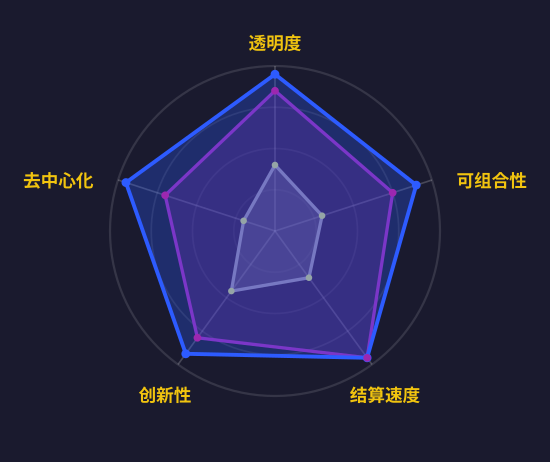
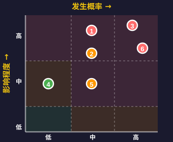

<!-- _class: lead -->

# DeFi结构化收益革命
## Strata vs Pendle vs TradFi产品深度比较

<!--
【学习笔记 - 第1页：封面】

核心概念：
- DeFi结构化收益革命：指去中心化金融领域对传统结构化产品的创新和重构
- 本演讲对比三类产品：Strata、Pendle、TradFi结构化产品

学习要点：
1. 什么是结构化收益产品？
2. DeFi如何改造传统金融产品？
3. Strata vs Pendle的核心差异是什么？
4. 相比TradFi，DeFi产品有哪些优势和劣势？

背景知识：
- 结构化产品：将不同风险/收益特征的资产组合，满足不同投资者需求
- DeFi：去中心化金融，基于区块链的金融服务
- TradFi：传统金融，银行、券商等中心化机构提供的金融服务

演讲目标：
理解DeFi结构化产品的创新点、风险和投资机会
-->

---

## 议程

  
01

  

    
结构化收益产品概述

  

  
02

  

    
Strata：风险分层协议

  

  
03

  

    
Pendle：收益代币化平台

  

  
04

  

    
TradFi对应产品

  

  
05

  

    
核心维度对比分析

  

  
06

  

    
风险与机遇评估

  

  
07

  

    
未来发展趋势

  

<!--
【学习笔记 - 第2页：议程】

演讲结构（7个部分）：

1. 结构化收益产品概述 - 基础概念，传统vs DeFi的对比
2. Strata：风险分层协议 - 核心机制、产品架构、创新点
3. Pendle：收益代币化平台 - PT/YT分离、产品矩阵
4. TradFi对应产品 - 传统结构化票据、优先/劣后结构
5. 核心维度对比分析 - 技术、风险、用户、监管、创新
6. 风险与机遇评估 - 市场规模、风险因素、投资策略
7. 未来发展趋势 - 行业展望、关键洞察

学习路径：
- 前3部分：理解每个产品的核心机制
- 第4-5部分：横向对比，找出差异和优势
- 第6-7部分：实践应用，投资决策

时间分配建议：
- 概述：3分钟
- 产品介绍：15分钟（每个5分钟）
- 对比分析：10分钟
- 风险与趋势：8分钟
- Q&A：5-10分钟
-->

---

## 什么是结构化收益产品？

### 将单一资产的收益流拆分/重组 创造不同风险/收益特征的金融产品

类比：将收益切分成不同份额，投资者根据风险偏好选择适合的层级

#### 拆分收益

将收益分为多个层级 （如Senior/Junior）

#### 定制风险

匹配不同风险偏好 （保守/激进）

#### 自由交易

代币化后可随时 在市场买卖

#### 传统金融 (TradFi)

准入门槛：$100K+

定价机制：不透明黑箱

流动性：锁定期内无法退出

#### DeFi创新

准入门槛：$10+

定价机制：透明链上算法

流动性：随时可交易退出

<!--
【学习笔记 - 第3页：什么是结构化收益产品？】

这一页的核心目标：
让观众在30秒内理解"结构化收益产品"是什么，为什么需要它。

---

第1部分：核心定义（最重要！）

一句话定义：
结构化收益产品 = 将单一资产的收益流拆分/重组，创造不同风险/收益特征的金融产品

拆解理解：
- 单一资产：如100 ETH质押、一笔贷款、一个LP仓位
- 收益流：资产产生的收益（利息、手续费、奖励等）
- 拆分/重组：把收益切成不同的部分
- 不同风险/收益特征：有的稳定低收益，有的波动高收益

为什么需要拆分？
因为不同投资者的需求不同：
- 退休基金：要稳定，不要波动
- 对冲基金：要高收益，可以承受波动
- 个人投资者：介于两者之间

传统方式：一个产品只能满足一种需求
结构化产品：一个资产拆分后，满足多种需求

---

第2部分：类比理解

类比说明：
想象你有一个大蛋糕（= 资产收益）

传统方式：
- 整块蛋糕只能卖给一个人
- 需求小的人买不起或用不完
- 需求大的人不够用

结构化产品：
- 把蛋糕切成小块、中块、大块
- 需求小的买小块（Senior - 稳定收益）
- 需求大的买大块（Junior - 高收益）
- 每个人都满意，资产利用率更高

关键洞察：
通过拆分，同一个资产可以服务更多人，提高资金效率！

---

第3部分：三大核心机制

机制1：拆分收益
- 做什么：将收益分为多个层级
- 例子：
  * 100 ETH质押，年收益5 ETH
  * 拆分为：Senior层（4 ETH固定）+ Junior层（1-10 ETH波动）
- 好处：满足不同风险偏好

机制2：定制风险
- 做什么：投资者根据风险承受能力选择层级
- 选择：
  * 保守型 → Senior（优先级，低风险低收益）
  * 激进型 → Junior（劣后级，高风险高收益）
  * 平衡型 → 混合配置
- 好处：每个人都能找到适合自己的产品

机制3：自由交易
- 做什么：将收益权代币化，可以随时买卖
- 传统问题：买入后锁定1年，中途无法退出
- DeFi解决：
  * Senior Token、Junior Token可以在DEX交易
  * 随时可以卖出退出
  * 不需要等到到期
- 好处：提高流动性，降低风险

---

第4部分：TradFi vs DeFi 对比

传统金融（TradFi）的限制：

1. 高门槛：$100K+
   - 需要"合格投资者"资格
   - 普通人无法参与
   - 例如：摩根大通的结构化票据，最低$100,000

2. 不透明定价
   - 定价算法是黑箱
   - 投资者不知道如何计算
   - 机构可能收取高额隐藏费用

3. 流动性差
   - 锁定期1-5年
   - 中途退出需要支付高额罚金
   - 或者根本无法退出

DeFi的创新突破：

1. 低门槛：$10+
   - 任何人都可以参与
   - 最低投资可以只有几美元
   - 真正的金融民主化

2. 透明定价
   - 智能合约代码开源
   - 定价算法公开可验证
   - 手续费明确显示

3. 高流动性
   - 代币化后可随时交易
   - 在Uniswap等DEX上自由买卖
   - 无需等待到期

关键对比数据：
| 维度 | TradFi | DeFi |
|------|--------|------|
| 最低投资 | $100,000 | $10 |
| 定价透明度 | 黑箱 | 完全透明 |
| 流动性 | 锁定1-5年 | 随时交易 |
| 准入要求 | 合格投资者 | 无需许可 |

---

演讲技巧：

开场（10秒）：
"什么是结构化收益产品？简单来说，就是把资产收益切蛋糕——切成不同大小的份额，让每个人选择适合自己的那一份。"

核心机制（30秒）：
"它有三个核心机制：
1. 拆分收益——分成多个层级
2. 定制风险——匹配不同偏好
3. 自由交易——代币化后随时买卖"

DeFi优势（20秒）：
"DeFi的创新在哪里？两个关键突破：
1. 门槛从$100K降到$10——人人可参与
2. 从黑箱定价到透明算法——完全可验证"

过渡到下一页：
"理解了基本概念后，让我们看看DeFi结构化产品的四大核心价值..."

---

常见问题预判：

Q1："拆分收益"具体怎么操作？
A：通过智能合约自动分配。例如：
- 总收益进入合约
- 合约先支付Senior层的固定收益
- 剩余部分全部给Junior层
- 全程自动化，无需人工干预

Q2：为什么要代币化？
A：代币化的好处：
- 可以在DEX上交易（流动性）
- 可以作为抵押品（可组合性）
- 可以转让给他人（灵活性）
- 所有权明确记录在链上（透明性）

Q3：这和传统的债券有什么区别？
A：相似之处：
- 都是固定收益产品
- 都有风险分层

不同之处：
- DeFi：透明、低门槛、高流动性
- 传统债券：不透明、高门槛、流动性差

Q4：普通人真的能参与吗？
A：是的！只需要：
- 一个加密钱包（如MetaMask）
- 少量ETH（可以从$10开始）
- 基本的DeFi知识
- 不需要任何资格认证

---

记忆要点（5个关键词）：

1. 拆分 - 把收益切成不同层级
2. 定制 - 匹配不同风险偏好
3. 代币化 - 可以自由交易
4. 低门槛 - $10 vs $100K
5. 透明 - 链上可验证

一句话总结：
结构化收益产品就是"金融乐高"——把收益拆开重组，让每个人都能找到适合自己的投资方式。

---

这一页成功的标准：
✅ 观众能用自己的话解释什么是结构化收益产品
✅ 观众理解为什么需要拆分收益
✅ 观众知道DeFi的核心优势（低门槛+透明）
✅ 观众对后续内容产生兴趣

如果观众还是不理解，用这个最简单的例子：
"假设你和朋友合买一套房出租，月租金$1000。你想要稳定收入，朋友想要高回报。怎么办？

结构化产品的解决方案：
- 你拿固定的$800/月（Senior）
- 朋友拿剩余的$200-2000/月（Junior，取决于出租率）
- 双方都满意！

这就是结构化收益产品的本质。"
-->

---

## 核心价值主张

### 风险定制化

匹配不同投资者的风险偏好

### 收益优化

分离与重组收益来源

### 流动性增强

代币化创造二级市场

### 透明度提升

链上可验证机制

<!--
【学习笔记 - 第4页：核心价值主张】

DeFi结构化产品的四大核心价值：

1. 风险定制化
   - 含义：投资者可以根据自己的风险承受能力选择不同层级
   - 例子：
     * 退休基金 → 选择Senior层级（优先级），保本为主
     * 对冲基金 → 选择Junior层级（劣后级），追求高收益
     * 个人投资者 → 混合配置，平衡风险
   - 优势：不再是"一刀切"，每个人都能找到适合自己的产品

2. 收益优化
   - 含义：通过分离和重组收益来源，提高资金效率
   - 机制：
     * 将收益拆分为固定收益（PT）和浮动收益（YT）
     * 不同投资者购买不同部分
     * 总收益 > 单独持有的收益（通过杠杆和套利）
   - 例子：Pendle的PT/YT分离机制

3. 流动性增强
   - 含义：将原本不可交易的收益权代币化，创造二级市场
   - 传统问题：买入结构化产品后，锁定期内无法退出
   - DeFi解决方案：
     * 收益权代币化（如PT、YT、Senior Token）
     * 在DEX上自由交易
     * 随时可以退出，不需要等到到期
   - 优势：提高资金效率，降低流动性风险

4. 透明度提升
   - 含义：所有规则、定价、资金流向都在链上公开
   - 具体体现：
     * 智能合约代码开源，任何人可审计
     * 每笔交易都可追溯
     * 定价算法透明，无法操纵
     * 实时查看资金池状态
   - 对比TradFi：传统产品定价不透明，投资者处于信息劣势

学习要点：
- 这四个价值是DeFi结构化产品的核心竞争力
- 理解每个价值如何解决传统金融的痛点
- 思考：这些价值对不同类型投资者的吸引力如何？

记忆技巧：
风险-收益-流动性-透明度（风收流透）
-->

---

## Strata：通用风险分层引擎

<!--
【学习笔记 - 第5页：Strata产品介绍】

核心概念：
Strata = 通用风险分层协议，将任何收益资产分层为不同风险级别的代币

工作原理：
1. 输入：任何生息资产（如stETH、aUSDC等）
2. 处理：通过智能合约分层为Senior（优先级）和Junior（劣后级）
3. 输出：两种代币，不同风险/收益特征

关键特点：
- 通用性：可以对任何DeFi收益资产进行分层
- 风险隔离：Senior层优先获得收益和本金，Junior层承担更多风险但获得更高收益
- 灵活性：可以自定义分层比例和参数

Strata的创新点：
- 不是针对特定资产的产品，而是一个通用的"风险分层引擎"
- 类似于"乐高积木"，可以组合任何DeFi资产
- 为DeFi带来了TradFi中的CDO（担保债务凭证）概念

实际应用：
- 将stETH分层 → Senior获得稳定4-6% APY，Junior获得杠杆化的10-15% APY
- 将Aave存款分层 → 满足不同风险偏好的投资者

学习要点：
- Strata的核心是"风险重新分配"
- Senior和Junior是零和博弈：Junior承担风险，Senior获得保护
- 理解瀑布式分配机制（Waterfall）
-->

<!-- Strata Tranche Mechanism - CSS-based Diagram -->

<!-- Vertical Flow Layout with Waterfall -->

  <!-- Level 1: Input -->
  

    

      <h4>输入</h4>
      
收益资产

      
stETH, sUSDe

    

  

  <!-- Arrow down -->
  
↓

  <!-- Level 2: Tranching Engine -->
  

    

      <h4>分层引擎</h4>
      
智能合约

      
按风险拆分

    

  

  <!-- Arrow down -->
  
↓

  <!-- Level 3: Senior + Junior side by side with output arrows -->
  

    

      

        <h4>SENIOR</h4>
        
低风险

        <ul>
          <li>稳定 4-6% APY</li>
          <li>优先偿付</li>
          <li>优先索赔</li>
        </ul>
      

      
↓

      
Senior 代币

    

    

      

        <h4>JUNIOR</h4>
        
高收益

        <ul>
          <li>10-20% APY</li>
          <li>承担首损</li>
          <li>剩余收益</li>
        </ul>
      

      
↓

      
Junior 代币

    

  

  <!-- Waterfall Legend -->
  

    收益流向 Senior 优先 → Junior 获得剩余
  

---

## Strata关键创新

<!--
【学习笔记 - 第6页：Strata关键创新】

这一页的核心目标：
展示Strata相比传统结构化产品的三大真正创新

根据Strata官方文档（docs.strata.money），Strata的定义是：
"Strata is a generalized risk-tranching protocol that brings structured yield products to any on-chain or off-chain yield strategy by splitting yield into two tokenized risk-based tranches."

---

Strata的三大真正创新：

1. 永续分层（Perpetual Tranching）

这是Strata最核心的创新！

含义：
Strata的收益分层结构是永续的（Perpetual），没有到期日，可以持续运作

与传统产品的对比：
- 传统CDO/结构化票据：有固定到期日（如3年、5年）
  * 到期后必须清算
  * 投资者需要重新配置资金
  * 存在再投资风险
  * 流动性在到期前受限

- Strata永续分层：无到期日
  * 收益持续流入Senior和Junior
  * 投资者可以随时进出（取决于流动性）
  * 更像股权投资而非债券
  * 长期持有者无需担心到期问题

技术实现：
- 智能合约设计为永续运行
- 收益分配每个区块/每天自动执行
- 没有"到期清算"的逻辑
- 投资者通过二级市场或赎回机制退出

优势：
- 无再投资风险：不需要在到期后寻找新产品
- 持续复利：收益可以持续再投资
- 降低摩擦成本：不需要频繁迁移资金
- 更好的流动性：代币化后可随时交易

例子：
传统CDO投资者：
- 2020年买入3年期CDO
- 2023年到期，收回本金+收益
- 需要重新寻找投资机会
- 可能面临市场环境变化

Strata投资者：
- 2020年买入srUSDe（Strata Senior USDe）
- 2023年仍在持有，持续获得收益
- 2026年仍在持有，无需任何操作
- 想退出时随时可以卖出代币

对DeFi的意义：
- 更符合DeFi"永续"的特性（如永续合约）
- 降低用户操作复杂度
- 提高资金效率

---

2. 超额抵押的Senior保护（Over-Collateralized Senior Protection）

官方描述：
"Strata Senior Tranche: An over-collateralized, yield-bearing synthetic dollar... It delivers superior risk-adjusted yield by providing protection against underlying strategy and collateral risks, guaranteed minimum yield tied to the benchmark rate, and uncapped upside exposure."

核心机制：
Junior层提供超额抵押，为Senior层提供多重保护

抵押比例：
- 典型配置：60-80% Senior / 20-40% Junior
- Junior提供的保护倍数：1.5-4倍
- 例如80/20配置：Junior需要亏损100%，才会影响到Senior

三重保护机制：

保护1：第一损失层（First Loss Tranche）
- 所有损失先从Junior扣除
- Junior作为"缓冲垫"
- 只有Junior完全耗尽，才会影响Senior

保护2：保证最低收益（Guaranteed Minimum Yield）
- Senior收益与基准利率挂钩
- 例如：保证至少获得3% APY
- 即使底层策略表现不佳，也有最低保障

保护3：上行无限（Uncapped Upside）
- 当底层策略表现优异时
- Senior也能分享超额收益
- 不像传统固定收益产品有收益上限

具体例子：
假设Strata对Aave借贷池分层，配置80/20

情景A：正常运行
- 借贷收益：5% APY
- Senior获得：4% APY（保证收益）
- Junior获得：9% APY（杠杆效应）
- 双方都满意 ✅

情景B：市场危机，出现坏账
- 借贷收益：3% APY
- 坏账损失：2%
- 净收益：1%
- Senior仍获得：4% APY（从Junior补贴）
- Junior承担损失：1% - 4% = -15% APY
- Senior受保护 ✅

情景C：DeFi Summer，收益爆发
- 借贷收益：20% APY
- Senior获得：6% APY（分享上行）
- Junior获得：74% APY（巨大杠杆）
- Senior也享受牛市 ✅

与2008金融危机CDO的对比：

2008 CDO的问题：
- 抵押不足：次级贷款质量差
- 评级失误：AAA评级的CDO实际风险很高
- 不透明：投资者无法实时监控风险
- 连锁崩溃：Senior层也遭受重大损失

Strata的改进：
- 超额抵押：链上实时可见
- 无需评级：智能合约自动执行
- 完全透明：所有数据公开
- 自动保护：触发阈值自动调整

实际数据（srUSDe为例）：
- Senior（srUSDe）：获得稳定的USDe质押收益
- Junior（jrUSDe）：提供150-250%的超额抵押
- 保护效果：即使USDe出现30%的损失，Senior仍安全

---

3. 模块化、链无关架构（Modular, Chain-Agnostic Architecture）

官方描述：
"Strata is a fully on-chain protocol with a modular, chain-agnostic architecture that enables expansion beyond USDe into a broad range of USD and non-USD assets and strategies across multiple ecosystems."

核心特点：
Strata不绑定特定资产或策略，可以对任何收益来源进行分层

支持的策略类型：

1. Curated lending vaults（精选借贷保险库）
   - Aave、Compound等借贷协议
   - 机构级借贷池
   - 点对点借贷

2. Managed multi-strategy vaults（多策略保险库）
   - Yearn Finance风格的收益聚合
   - 自动在多个协议间切换
   - 动态优化收益

3. Exotic delta-neutral strategies（异形delta中性策略）
   - 对冲基金级别的复杂策略
   - 市场中性套利
   - 降低价格波动风险

4. Tokenized private credit（代币化私人信贷）
   - 将传统私人信贷代币化
   - 链上化的企业贷款
   - RWA（真实世界资产）的一种

5. High-yield RWAs（高收益真实世界资产）
   - 房地产收益
   - 商业票据
   - 其他链下资产的收益

链无关部署：
- 不局限于以太坊主网
- 可部署到任何EVM兼容链：
  * Arbitrum（低Gas费）
  * Optimism（快速确认）
  * Polygon（高吞吐量）
  * Avalanche（低延迟）
  * Base、Blast等新兴L2

技术实现：
- 标准化的智能合约接口
- 适配器模式（Adapter Pattern）
- 跨链桥集成
- 统一的前端界面

模块化的优势：

优势1：灵活性
- 市场环境变化时，可以切换底层策略
- 不需要重新部署整个系统
- 类似"乐高积木"，可自由组合

优势2：可扩展性
- 轻松添加新的收益策略
- 支持未来的创新协议
- 不受限于当前的DeFi生态

优势3：风险分散
- 不依赖单一协议或资产
- 可以同时对多个策略分层
- 降低单点故障风险

优势4：跨链优化
- 在Gas费低的链上部署
- 覆盖不同链的用户群
- 提高整体资金效率

实际应用例子：

例子1：从USDe扩展到其他资产
- 初始：Strata对Ethena的USDe分层
- 扩展：可以对任何稳定币（USDC、DAI）分层
- 未来：可以对BTC、ETH等波动资产分层

例子2：跨链部署
- 以太坊主网：面向大额投资者（安全优先）
- Arbitrum：面向普通用户（低成本）
- Base：面向Coinbase用户（易用性）
- 同样的产品逻辑，不同的链上环境

例子3：策略切换
- 初始：对Aave USDC借贷分层
- 市场变化：Compound收益率更高
- 操作：切换到Compound
- 结果：投资者自动享受更高收益

对比传统金融：
- TradFi结构化产品：
  * 绑定特定资产（如某个CDO只能投资次级贷款）
  * 受限于特定司法管辖区
  * 无法跨市场部署

- Strata：
  * 支持任意资产和策略
  * 全球无边界
  * 多链部署

---

总结：三大创新的协同效应

永续分层 + 超额抵押 + 模块化架构 =
下一代DeFi结构化产品

1. 永续分层：解决了"时间"问题
   - 无需担心到期和再投资
   - 持续复利，长期增长

2. 超额抵押：解决了"安全"问题
   - 多重保护机制
   - 透明可验证

3. 模块化架构：解决了"灵活性"问题
   - 适应任何策略和资产
   - 跨链部署，全球覆盖

Strata的愿景：
"将结构化收益产品带给任何链上或链下的收益策略"

这三大创新让Strata不仅仅是"DeFi版的CDO"，
而是一个全新的、更安全、更灵活、更持久的收益优化协议。

---

关键术语：

Perpetual（永续）：
- 没有到期日，持续运行
- 类似永续合约（Perpetual Futures）

Over-Collateralization（超额抵押）：
- 抵押物价值 > 借出价值
- 提供安全缓冲

First Loss Tranche（第一损失层）：
- 承担首要损失的层级
- 保护其他层级

Modular（模块化）：
- 可插拔的组件设计
- 类似乐高积木

Chain-Agnostic（链无关）：
- 不依赖特定区块链
- 可在多链部署

Benchmark Rate（基准利率）：
- 参考利率，如美国国债利率
- Strata中可能是USDe的基础质押收益

Uncapped Upside（上行无限）：
- 收益没有上限
- 可以分享超额收益

---

演讲要点：

开场（5秒）：
"Strata的三大创新让它成为下一代DeFi结构化产品"

逐个讲解（各10秒）：
1. "永续分层 - 无到期日，持续运作，像永续合约一样"
2. "超额抵押 - Junior提供多重保护，Senior极度安全"
3. "模块化架构 - 支持任何收益策略，跨链部署"

总结（5秒）：
"这三点结合，创造了一个更安全、更灵活、更持久的收益优化协议"

过渡到下一页：
"理解了Strata的创新后，让我们看看Pendle如何从另一个角度解决问题..."
-->

### 永续分层

无到期日的持续收益结构

### 超额抵押

Senior层的多重保护

### 模块化架构

支持任意收益策略

---

## Pendle：收益代币化平台

<!--
【学习笔记 - 第7页：Pendle产品介绍】

核心概念：
Pendle = 收益代币化协议，将生息资产的本金和收益分离为两个独立可交易的代币

PT/YT分离机制：
1. 输入：生息资产（如stETH、aUSDC）
2. 分离：
   - PT (Principal Token) = 本金代币，代表到期时赎回本金的权利
   - YT (Yield Token) = 收益代币，代表到期前所有收益的权利
3. 交易：PT和YT可以在AMM上独立交易

工作原理示例：
假设你有100 stETH（年化收益5%）：
- 存入Pendle → 获得100 PT-stETH + 100 YT-stETH
- PT-stETH：1年后可赎回100 stETH（折价交易，如95 ETH）
- YT-stETH：1年内获得所有staking收益（约5 ETH）

核心价值：
1. 固定收益：买入PT = 锁定固定收益率（类似债券）
2. 收益杠杆：买入YT = 杠杆化收益敞口（高风险高收益）
3. 对冲策略：组合PT/YT实现复杂策略

与Strata的区别：
- Strata：风险分层（Senior vs Junior）
- Pendle：收益分离（本金 vs 收益）
- Strata：关注风险保护
- Pendle：关注收益优化

实际应用场景：
- 保守投资者：买入PT，锁定固定收益，类似买债券
- 激进投资者：买入YT，获得杠杆化收益敞口
- 套利者：利用PT/YT价格差异进行套利

学习要点：
- PT类似零息债券（Zero-Coupon Bond）
- YT类似收益互换（Yield Swap）
- 理解PT+YT=原始资产的等式
-->

  <!-- Level 1: Input -->
  

    

      <h4>输入</h4>
      
生息资产

      
stETH, sDAI, LST

    

  

  <!-- Arrow down -->
  
↓

  <!-- Level 2: Pendle Protocol -->
  

    

      <h4>PENDLE 协议</h4>
      
收益代币化

      
分离本金 + 收益

    

  

  <!-- Arrow down -->
  
↓

  <!-- Level 3: PT + YT side by side with output arrows -->
  

    

      

        <h4>PT</h4>
        
本金代币

        <ul>
          <li>固定收益</li>
          <li>折价交易</li>
          <li>低波动性</li>
        </ul>
      

      
↓

      
到期赎回

    

    

      

        <h4>YT</h4>
        
收益代币

        <ul>
          <li>浮动收益</li>
          <li>收益敞口</li>
          <li>高波动性</li>
        </ul>
      

      
↓

      
收取收益

    

  

  <!-- Legend -->
  

    PT + YT = 原始资产（到期时）
  

---

## Pendle产品矩阵

<!--
【学习笔记 - 第8页：Pendle产品矩阵】

Pendle的三大产品线：

1. 固定收益产品（PT）
   - 目标用户：保守型投资者、机构
   - 特点：
     * 锁定固定收益率，无需担心市场波动
     * 类似传统金融的债券
     * 到期时按面值赎回
   - 收益来源：买入折价PT，到期获得面值差价
   - 风险：利率风险（如果市场利率上升，PT价格下跌）
   - 例子：以95 ETH买入100 PT-stETH，1年后赎回100 ETH，收益率≈5.26%

2. 杠杆收益产品（YT）
   - 目标用户：激进型投资者、交易员
   - 特点：
     * 杠杆化的收益敞口
     * 高风险高收益
     * 到期时价值归零（收益已分配）
   - 收益来源：获得底层资产的所有收益
   - 风险：如果底层资产收益率下降，YT价值大幅缩水
   - 杠杆倍数：通常2-5倍，取决于到期时间和市场条件

3. 流动性提供（LP）
   - 目标用户：做市商、套利者
   - 特点：
     * 为PT/YT提供流动性，赚取交易手续费
     * 获得PENDLE代币奖励
     * 承担无常损失风险
   - 收益来源：
     * 交易手续费（通常0.1-0.3%）
     * PENDLE代币激励
     * 可能的协议收入分成
   - 风险：无常损失、智能合约风险

产品组合策略：
- 保守组合：80% PT + 20% LP
- 平衡组合：50% PT + 30% YT + 20% LP
- 激进组合：70% YT + 30% LP

学习要点：
- PT和YT是互补产品，满足不同风险偏好
- LP是生态的基础，提供流动性支持
- 理解每个产品的风险/收益特征
- 思考：如何根据市场条件选择合适的产品？

记忆技巧：
PT=保守（Principal），YT=激进（Yield），LP=做市（Liquidity Provider）
-->

杠杆

### Boros

带杠杆的收益交易

最高10倍杠杆

现货

### V2 Spot

现货收益交易

固定收益获取

治理

### vePENDLE

治理代币

收益加成系统

---

## TradFi结构化产品

<!--
【学习笔记 - 第9页：TradFi结构化产品】

传统金融的结构化产品类型：

1. 结构化票据（Structured Notes）
   - 定义：银行发行的债务工具，收益与特定资产（股票、指数、商品）挂钩
   - 特点：
     * 本金保护（部分或全部）
     * 收益与标的资产表现挂钩
     * 通常有锁定期（1-5年）
   - 例子：
     * 保本型：100%本金保护 + 标普500指数70%参与率
     * 增强型：90%本金保护 + 标普500指数120%参与率
   - 风险：发行银行信用风险、流动性风险

2. CDO（担保债务凭证）
   - 定义：将债务资产（贷款、债券）打包，分层为不同风险级别
   - 分层结构：
     * Senior层（AAA评级）：优先获得本金和利息，低收益
     * Mezzanine层（BBB评级）：中等风险和收益
     * Equity层（无评级）：最后获得分配，高风险高收益
   - 2008金融危机教训：
     * 评级机构失职，给次级贷款CDO高评级
     * 不透明的定价和风险评估
     * 过度杠杆化导致系统性风险
   - 与Strata的对比：Strata是透明的链上版本CDO

3. 优先/劣后结构基金
   - 定义：将基金份额分为优先级和劣后级
   - 机制：
     * 优先级：固定收益（如8%），优先分配
     * 劣后级：剩余收益，承担更多风险
   - 应用：私募股权、房地产基金
   - 与Strata的相似性：都是风险分层结构

TradFi结构化产品的共同特点：
- ✅ 成熟的风险管理框架
- ✅ 监管保护
- ❌ 不透明的定价
- ❌ 高门槛（通常$100K+）
- ❌ 流动性差
- ❌ 依赖中介机构

学习要点：
- TradFi结构化产品已有几十年历史，市场规模巨大
- DeFi正在用透明、开放的方式重构这些产品
- 理解TradFi的优势（监管、成熟度）和劣势（不透明、高门槛）
-->

保本型

### 结构化票据

• 本金保护型

• 收益增强型

• 股权联动型

分层型

### 担保债务凭证

• 分层信用风险

• 资产支持证券

• 再证券化产品

衍生品

### 利率衍生品

• 利率互换

• 上限/下限期权

• 掉期期权

---

## 技术架构对比

<!--
【学习笔记 - 第10页：技术架构对比】

技术能力雷达图解读：

这个五边形雷达图从5个维度对比Strata、Pendle和TradFi的技术能力：

1. 透明度（Transparency）
   - Strata: 95分 - 智能合约开源，所有逻辑链上可验证
   - Pendle: 85分 - 智能合约开源，AMM机制透明
   - TradFi: 40分 - 定价模型不公开，黑箱操作
   - 关键差异：DeFi天然透明，TradFi依赖信任

2. 可组合性（Composability）
   - Strata: 90分 - 输出代币可作为其他协议输入，高度模块化
   - Pendle: 75分 - PT/YT可组合，但相对独立
   - TradFi: 30分 - 产品封闭，难以组合
   - 关键差异：DeFi的"乐高积木"特性 vs TradFi的孤岛效应

3. 结算速度（Settlement Speed）
   - Strata: 95分 - 实时链上结算，秒级确认
   - Pendle: 95分 - 实时链上结算
   - TradFi: 35分 - T+2或更长结算周期
   - 关键差异：区块链的即时性 vs 传统金融的延迟

4. 创新性（Innovation）
   - Strata: 92分 - 动态风险调整，通用分层引擎
   - Pendle: 80分 - PT/YT分离机制，AMM创新
   - TradFi: 45分 - 产品创新缓慢，受监管限制
   - 关键差异：DeFi快速迭代 vs TradFi稳健保守

5. 去中心化（Decentralization）
   - Strata: 95分 - 完全去中心化，无需许可
   - Pendle: 70分 - 部分去中心化，有治理机制
   - TradFi: 20分 - 高度中心化，依赖机构
   - 关键差异：信任最小化 vs 信任中介

综合分析：
- Strata和Pendle：在透明度、可组合性、结算速度、去中心化方面远超TradFi
- TradFi：在监管合规、用户保护方面有优势（未在此图显示）
- 趋势：DeFi技术优势明显，但需要在监管和用户体验上改进

学习要点：
- 理解每个维度的含义和重要性
- DeFi的技术优势是颠覆性的
- TradFi的优势在于监管和成熟度，不在技术
- 未来可能是混合模式：DeFi技术 + TradFi监管
-->

技术能力雷达图

  

  

    

    Strata
  

  

    

    Pendle
  

  

    

    TradFi
  

<table class="tech-table">
<thead>
  <tr>
    <th>维度</th>
    <th>Strata</th>
    <th>Pendle</th>
    <th>TradFi</th>
  </tr>
</thead>
<tbody>
  <tr>
    <td>透明度</td>
    <td class="strata-col">完全链上透明</td>
    <td class="pendle-col">链上透明</td>
    <td class="tradfi-col">有限透明</td>
  </tr>
  <tr>
    <td>可组合性</td>
    <td class="strata-col">高度可组合</td>
    <td class="pendle-col">中等可组合</td>
    <td class="tradfi-col">低可组合</td>
  </tr>
  <tr>
    <td>结算速度</td>
    <td class="strata-col">实时结算</td>
    <td class="pendle-col">实时结算</td>
    <td class="tradfi-col">T+2或更长</td>
  </tr>
  <tr>
    <td>创新性</td>
    <td class="strata-col">链无关架构</td>
    <td class="pendle-col">AMM机制</td>
    <td class="tradfi-col">传统模式</td>
  </tr>
  <tr>
    <td>去中心化</td>
    <td class="strata-col">完全去中心化</td>
    <td class="pendle-col">部分去中心化</td>
    <td class="tradfi-col">中心化</td>
  </tr>
</tbody>
</table>

---

## 风险/收益特征

<!--
【学习笔记 - 第11页：风险/收益特征】

三类产品的风险/收益对比：

Strata产品：
1. Senior层级
   - 预期收益：4-8% APY
   - 风险等级：低
   - 特点：优先获得本金和收益，有Junior层保护
   - 适合：保守投资者、机构资金
   - 风险：智能合约风险、底层资产风险（但有缓冲）

2. Junior层级
   - 预期收益：12-25% APY
   - 风险等级：高
   - 特点：承担首损风险，获得杠杆化收益
   - 适合：激进投资者、风险偏好高的交易员
   - 风险：可能损失全部本金

Pendle产品：
1. PT（本金代币）
   - 预期收益：3-6% 固定收益
   - 风险等级：低-中
   - 特点：锁定固定收益率，类似债券
   - 适合：寻求稳定收益的投资者
   - 风险：利率风险、智能合约风险

2. YT（收益代币）
   - 预期收益：10-30% APY（波动大）
   - 风险等级：高
   - 特点：杠杆化收益敞口，到期归零
   - 适合：看好底层资产收益率的投资者
   - 风险：收益率下降导致价值归零

3. LP（流动性提供）
   - 预期收益：8-15% APY
   - 风险等级：中
   - 特点：赚取手续费+代币激励
   - 适合：做市商、长期持有者
   - 风险：无常损失、智能合约风险

TradFi产品：
1. 结构化票据
   - 预期收益：2-8% APY
   - 风险等级：低-中
   - 特点：部分本金保护，收益与标的挂钩
   - 适合：保守投资者
   - 风险：发行机构信用风险、流动性风险

2. CDO
   - 预期收益：Senior 3-5%，Equity 15-25%
   - 风险等级：Senior低，Equity高
   - 特点：分层风险结构
   - 适合：不同风险偏好的机构投资者
   - 风险：评级不准确、系统性风险（2008教训）

关键对比：
- 收益率：DeFi > TradFi（因为去除中介成本）
- 风险：DeFi智能合约风险 vs TradFi信用风险
- 波动性：DeFi > TradFi（加密市场波动大）
- 流动性：DeFi > TradFi（代币化带来流动性）

学习要点：
- 高收益必然伴随高风险
- 理解每个产品的风险来源
- DeFi的额外风险：智能合约、预言机、治理
- 选择产品时要匹配自己的风险承受能力
-->

<!-- Strata列 -->

Strata

#### Senior

年化收益

基准+1-3%

风险

低

流动性

高

最小额

$100

#### Junior

年化收益

10-30%+

风险

高

流动性

高

最小额

$500

<!-- Pendle列 -->

Pendle

#### Fixed

年化收益

固定5-8%

风险

中

流动性

高

最小额

$50

#### Leveraged

年化收益

15-50%+

风险

高

流动性

高

最小额

$200

<!-- TradFi列 -->

TradFi

#### 票据

年化收益

3-6%

风险

低-中

流动性

低

最小额

$25K

#### CDOs

年化收益

8-15%+

风险

高

流动性

低

最小额

$100K

---

## 目标用户群体

<!--
【学习笔记 - 第12页：目标用户群体】

三类产品的目标用户对比：

Strata目标用户：
1. DeFi原生用户
   - 特征：熟悉智能合约、钱包操作
   - 需求：在DeFi收益基础上进一步优化风险/收益
   - 典型场景：将stETH分层，Senior获得稳定收益，Junior获得杠杆收益

2. 风险管理者
   - 特征：需要精细化风险控制
   - 需求：将投资组合分层，隔离风险
   - 典型场景：DAO金库将资产分层，Senior部分用于运营，Junior部分用于增长

3. 机构投资者
   - 特征：大资金量，需要合规和风险管理
   - 需求：在DeFi中找到类似TradFi的风险分层工具
   - 典型场景：加密基金使用Strata构建分层产品

Pendle目标用户：
1. 固定收益寻求者
   - 特征：厌恶波动，寻求稳定收益
   - 需求：在加密市场中锁定固定收益率
   - 典型场景：买入PT-stETH，锁定5% APY

2. 收益交易员
   - 特征：看好/看空未来收益率
   - 需求：交易收益率曲线
   - 典型场景：
     * 看好收益率上升 → 买入YT
     * 看空收益率下降 → 卖出YT或买入PT

3. 套利者
   - 特征：寻找定价错误
   - 需求：利用PT/YT价格差异套利
   - 典型场景：PT+YT价格 ≠ 底层资产价格时进行套利

TradFi目标用户：
1. 高净值个人
   - 特征：资产$1M+，寻求资产配置
   - 需求：保本增值、税务优化
   - 典型场景：购买结构化票据，部分本金保护+股市参与

2. 机构投资者
   - 特征：养老金、保险公司、捐赠基金
   - 需求：稳定收益、监管合规
   - 典型场景：投资AAA级CDO，获得稳定现金流

3. 企业财务部门
   - 特征：企业闲置资金管理
   - 需求：流动性管理、收益优化
   - 典型场景：购买短期结构化产品，优化现金管理

用户群体对比分析：
- 准入门槛：
  * Strata/Pendle：几美元起，无KYC
  * TradFi：$100K+，需要合格投资者资格
- 技术要求：
  * Strata/Pendle：需要理解DeFi、钱包、智能合约
  * TradFi：通过顾问/银行，技术要求低
- 监管保护：
  * Strata/Pendle：无监管保护，自负盈亏
  * TradFi：有投资者保护机制

学习要点：
- DeFi降低了准入门槛，但提高了技术门槛
- 不同产品服务不同风险偏好的用户
- 理解目标用户有助于选择合适的产品
-->

### Strata用户

<strong>机构投资者</strong>

稳定收益+超额回报

<strong>DeFi资深用户</strong>

高杠杆机会

### Pendle用户

<strong>收益交易者</strong>

收益套利

<strong>固定收益投资者</strong>

确定性现金流

### TradFi用户

<strong>银行资管</strong>

合规产品

<strong>退休基金</strong>

本金保护

---

## 监管环境对比

<!--
【学习笔记 - 第13页：监管环境对比】

监管环境的三个维度对比：

1. 监管框架

Strata/Pendle（DeFi）：
- 现状：监管真空，大部分国家尚未明确监管
- 优势：
  * 创新自由度高
  * 无需许可，全球可访问
  * 快速迭代和实验
- 劣势：
  * 法律不确定性
  * 投资者保护缺失
  * 可能面临未来监管打击
- 趋势：
  * 欧盟MiCA法规（2024生效）
  * 美国SEC加强执法
  * 各国逐步建立DeFi监管框架

TradFi：
- 现状：成熟的监管体系
- 监管机构：
  * 美国：SEC、CFTC、OCC
  * 欧盟：ESMA、各国金融监管局
  * 中国：银保监会、证监会
- 优势：
  * 投资者保护完善
  * 市场稳定性高
  * 争议解决机制成熟
- 劣势：
  * 创新受限
  * 合规成本高
  * 准入门槛高

2. 合规要求

Strata/Pendle：
- KYC/AML：通常不要求（去中心化）
- 信息披露：智能合约代码公开，但无强制披露要求
- 资本要求：无
- 审计要求：自愿进行智能合约审计
- 风险：可能被认定为未注册证券

TradFi：
- KYC/AML：严格要求，必须验证身份
- 信息披露：详细的招股说明书、定期报告
- 资本要求：发行机构需满足资本充足率
- 审计要求：强制性财务审计
- 投资者适当性：需评估投资者风险承受能力

3. 投资者保护

Strata/Pendle：
- 保护机制：
  * 智能合约审计（非强制）
  * 社区治理
  * 代码开源透明
- 争议解决：
  * 无正式机制
  * 依赖社区共识
  * 可能通过链上治理
- 风险：
  * 智能合约漏洞无赔偿
  * 黑客攻击损失自负
  * 无存款保险

TradFi：
- 保护机制：
  * 存款保险（如FDIC）
  * 投资者赔偿基金
  * 监管机构监督
- 争议解决：
  * 法院诉讼
  * 仲裁机制
  * 监管机构介入
- 优势：
  * 机构破产有保护
  * 欺诈行为可追责
  * 系统性风险有央行兜底

关键洞察：
- DeFi的监管困境：去中心化 vs 监管要求的矛盾
- 未来趋势：混合模式
  * 链上透明 + 链下合规
  * 去中心化技术 + 中心化合规层
  * 例如：许可型DeFi（Permissioned DeFi）

学习要点：
- 监管不是坏事，是保护投资者的必要手段
- DeFi需要在创新和合规之间找到平衡
- 理解监管风险是投资DeFi的重要考量
- 关注监管动态，可能影响产品可用性
-->

<!-- 核心对比表格 -->

<table class="regulation-table">
<thead>
  <tr>
    <th>维度</th>
    <th class="defi-col">DeFi</th>
    <th class="tradfi-col">TradFi</th>
  </tr>
</thead>
<tbody>
  <tr>
    <td>法律框架</td>
    <td class="defi-col">模糊 - 监管不确定性高</td>
    <td class="tradfi-col">明确 - 完善的法律体系</td>
  </tr>
  <tr>
    <td>准入门槛</td>
    <td class="defi-col">低 - 无KYC，全球可访问</td>
    <td class="tradfi-col">高 - 严格的资质要求</td>
  </tr>
  <tr>
    <td>创新速度</td>
    <td class="defi-col">快 - 无需审批，快速迭代</td>
    <td class="tradfi-col">慢 - 漫长的审批流程</td>
  </tr>
  <tr>
    <td>投资者保护</td>
    <td class="defi-col">弱 - 自担风险，无追索权</td>
    <td class="tradfi-col">强 - 监管保护，争议解决</td>
  </tr>
  <tr>
    <td>合规成本</td>
    <td class="defi-col">低 - 技术驱动，成本可控</td>
    <td class="tradfi-col">高 - 人力密集，持续投入</td>
  </tr>
  <tr>
    <td>透明度</td>
    <td class="defi-col">高 - 链上公开，实时可查</td>
    <td class="tradfi-col">中 - 定期披露，信息滞后</td>
  </tr>
</tbody>
</table>

<!-- 关键洞察 -->

💡

DeFi正从"监管套利"向"主动合规"转型，未来将与TradFi形成互补而非对立关系

---

## 创新亮点对比

<!--
【学习笔记 - 第14页：创新亮点对比】

三类产品的核心创新对比：

Strata的创新亮点：
1. 通用风险分层引擎
   - 创新点：不针对特定资产，而是通用的分层协议
   - 意义：任何DeFi收益资产都可以分层
   - 类比：像"风险分层的Uniswap"

2. 动态风险调整
   - 创新点：根据市场条件自动调整风险参数
   - 意义：比传统固定比例更高效
   - 技术：使用预言机和算法自动再平衡

3. 可组合性
   - 创新点：输出代币可作为其他协议的输入
   - 意义：创造无限金融产品组合可能
   - 例子：Strata Senior → Aave抵押品 → 借贷 → 再投资

Pendle的创新亮点：
1. 收益代币化（PT/YT分离）
   - 创新点：将本金和收益分离为独立可交易代币
   - 意义：创造了DeFi的"固定收益市场"
   - 对比TradFi：类似零息债券，但更灵活

2. AMM for Yield
   - 创新点：专门为收益交易设计的AMM
   - 技术：考虑时间衰减的定价曲线
   - 意义：提供PT/YT的流动性和价格发现

3. vePENDLE治理模型
   - 创新点：投票托管（Vote-Escrowed）模型
   - 机制：锁定PENDLE → 获得vePENDLE → 提升收益+治理权
   - 意义：激励长期持有，减少抛压

TradFi的"创新"（相对保守）：
1. 结构化票据
   - 特点：本金保护+市场参与
   - 限制：产品设计复杂，不透明
   - 问题：2008金融危机暴露的风险

2. CDO分层
   - 特点：风险分层结构
   - 限制：评级依赖第三方，可能不准确
   - 教训：过度证券化导致系统性风险

3. 利率衍生品
   - 特点：对冲利率风险
   - 限制：只有机构可访问，散户无法参与
   - 复杂性：需要专业知识

创新对比总结：

| 维度 | Strata | Pendle | TradFi |
|------|--------|--------|--------|
| 创新速度 | 快（月级迭代） | 快（月级迭代） | 慢（年级迭代） |
| 技术创新 | 高（智能合约） | 高（AMM+代币化） | 低（传统金融工程） |
| 可组合性 | 极高 | 高 | 低 |
| 透明度 | 完全透明 | 完全透明 | 不透明 |
| 准入门槛 | 低 | 低 | 高 |

关键洞察：
- DeFi的创新优势：
  * 开源协作，创新速度快
  * 可组合性带来指数级创新
  * 透明度降低信息不对称
- TradFi的创新劣势：
  * 监管限制创新
  * 封闭系统，难以组合
  * 创新主要服务机构，不惠及散户

学习要点：
- DeFi正在重构传统金融产品，而不是简单复制
- 可组合性是DeFi最大的创新优势
- 理解每个产品的创新点，有助于评估其长期价值
-->

### Strata创新

通用风险分层

超额抵押机制

链无关设计

### Pendle创新

收益代币标准化

收益AMM

veTokenomics

### TradFi优势

成熟风险模型

监管框架

机构网络

---

## 市场规模与增长

<!--
【学习笔记 - 第15页：市场规模与增长】

市场规模对比（2024年数据）：

TradFi结构化产品市场：
- 全球规模：~$10-15万亿美元
- 主要市场：
  * 美国：$3-4万亿
  * 欧洲：$4-5万亿
  * 亚洲：$2-3万亿
- 产品类型分布：
  * 结构化票据：40%
  * CDO/CLO：30%
  * 利率衍生品：20%
  * 其他：10%
- 增长率：年化3-5%（成熟市场，增长缓慢）

DeFi结构化产品市场：
- Strata TVL：~$50-100M（截至2024）
- Pendle TVL：~$3-5B（截至2024，快速增长）
- 整体DeFi结构化产品：~$5-10B
- 占DeFi总TVL比例：~5-10%
- 增长率：年化50-100%（高速增长期）

市场规模对比分析：
1. 绝对规模：
   - TradFi是DeFi的1000-2000倍
   - DeFi仍处于早期阶段
   - 巨大的增长空间

2. 增长速度：
   - DeFi增长率是TradFi的10-20倍
   - 复合增长效应显著
   - 预计5-10年内可达TradFi的1-5%

3. 渗透率：
   - DeFi结构化产品占DeFi总TVL的5-10%
   - TradFi结构化产品占传统金融的更高比例
   - DeFi还有很大渗透空间

增长驱动因素：

DeFi增长驱动：
1. 技术成熟：
   - Layer 2降低gas费用
   - 跨链互操作性提升
   - 用户体验改善

2. 机构采用：
   - 传统金融机构进入DeFi
   - 监管框架逐步明确
   - 合规产品增加

3. 产品创新：
   - 新的收益来源（RWA、LSD等）
   - 更复杂的结构化产品
   - 更好的风险管理工具

4. 市场教育：
   - 用户对DeFi理解加深
   - 更多教育资源
   - 社区生态成熟

TradFi增长限制：
1. 监管限制：创新受限
2. 高成本：中介费用高
3. 低效率：结算周期长
4. 准入门槛：散户难以参与

未来预测（2025-2030）：

保守预测：
- DeFi结构化产品TVL：$50-100B
- 年化增长率：30-50%
- 占DeFi总TVL：10-15%

乐观预测：
- DeFi结构化产品TVL：$200-500B
- 年化增长率：50-100%
- 占DeFi总TVL：15-20%
- 开始蚕食TradFi市场份额

关键里程碑：
- 2025：Pendle TVL突破$10B
- 2026：主流机构推出DeFi结构化产品
- 2027：监管框架明确，合规产品爆发
- 2028-2030：DeFi结构化产品成为主流

学习要点：
- DeFi市场虽小，但增长迅速
- 理解增长驱动因素，把握投资机会
- 关注TVL变化，反映市场信心
- 长期看好DeFi结构化产品的发展
-->

  

    
总市场

    
$10万亿

  

  

    

    

      TradFi
      $8.5万亿 (85%)
    

  

  

    

    

      DeFi
      $1500亿 (1.5%)
    

  

  

    

    

      其他
      $1.35万亿 (13.5%)
    

  

复合年均增长率 (CAGR)

#### DeFi结构化产品

100%+

  Strata: 140% | Pendle: 95%

#### TradFi结构化产品

8%

  稳定但增长缓慢

---

## 风险因素分析（1/2）

<!--
【学习笔记 - 第16页：风险因素分析（1/2）】

风险矩阵图解读：
这个风险矩阵从两个维度评估6大风险：
- X轴：发生概率（低/中/高）
- Y轴：影响程度（低/中/高）

6大风险因素详解：

1. 智能合约风险（高概率/高影响）
- 位置：右上角（红色区域）- 最需要关注
- 发生概率：高
  * DeFi历史上多次发生智能合约漏洞
  * 2022年：$3.1B被盗（主要是智能合约漏洞）
  * 复杂的合约更容易有bug
- 影响程度：高
  * 可能导致全部资金损失
  * 无法追回（区块链不可逆）
  * 无保险赔偿
- 缓解措施：
  * 选择经过多次审计的协议
  * 查看审计报告（Certik、Trail of Bits等）
  * 关注bug bounty计划
  * 分散投资，不要all-in单一协议
- 实际案例：
  * 2021 Poly Network：$611M被盗（后归还）
  * 2022 Ronin Bridge：$625M被盗
  * 2023 Euler Finance：$197M被盗（部分追回）

2. 流动性风险（中概率/高影响）
- 位置：中上区域（橙色）
- 发生概率：中
  * 市场恐慌时流动性枯竭
  * 小型池子容易出现流动性问题
- 影响程度：高
  * 无法退出头寸
  * 被迫接受巨大滑点
  * 可能引发连锁清算
- 缓解措施：
  * 选择TVL大的协议
  * 检查流动性深度
  * 避免在市场恐慌时交易
  * 设置合理的滑点容忍度
- 实际案例：
  * 2022年5月UST脱锚，Curve 3pool流动性枯竭
  * 2023年3月USDC脱锚，多个DeFi协议流动性危机

3. 预言机风险（中概率/高影响）
- 位置：中上区域（橙色）
- 发生概率：中
  * 预言机被操纵
  * 数据源失效
  * 网络延迟导致价格偏差
- 影响程度：高
  * 错误定价导致套利损失
  * 不公平清算
  * 协议资金损失
- 缓解措施：
  * 使用多个预言机（Chainlink、Band等）
  * 检查预言机更新频率
  * 关注预言机的去中心化程度
- 实际案例：
  * 2020年11月Compound清算事件（Coinbase预言机故障）
  * 2022年Mango Markets操纵事件（$110M损失）

学习要点：
- 右上角的风险（高概率+高影响）需要最优先关注
- 智能合约风险是DeFi最大的风险
- 理解每个风险的缓解措施
- 风险管理比追求高收益更重要
-->

<!-- 左侧：风险矩阵散点图 -->

风险矩阵图

<!-- 右侧：风险详情表格 -->

智能合约风险详情

<table class="risk-table">
<thead>
  <tr>
    <th>风险类型</th>
    <th>概率</th>
    <th>影响</th>
    <th>优先级</th>
  </tr>
</thead>
<tbody>
  <tr>
    <td>1. Strata合约漏洞</td>
    <td>中</td>
    <td>高</td>
    <td class="priority-high">高</td>
  </tr>
  <tr>
    <td>2. Pendle AMM漏洞</td>
    <td>中</td>
    <td>中高</td>
    <td class="priority-medium">中</td>
  </tr>
  <tr>
    <td>3. 预言机攻击</td>
    <td>中高</td>
    <td>高</td>
    <td class="priority-high">高</td>
  </tr>
  <tr>
    <td>4. 治理攻击</td>
    <td>低</td>
    <td>中</td>
    <td class="priority-low">低</td>
  </tr>
  <tr>
    <td>5. 流动性风险</td>
    <td>中</td>
    <td>中</td>
    <td class="priority-medium">中</td>
  </tr>
  <tr>
    <td>6. 监管风险</td>
    <td>高</td>
    <td>中高</td>
    <td class="priority-high">高</td>
  </tr>
</tbody>
</table>

---

## 风险因素分析（2/2）

### 市场风险

<!--
【学习笔记 - 第17页：风险因素分析（2/2）】

继续分析剩余3大风险：

4. 监管风险（中概率/中影响）
- 位置：中心区域（黄色）
- 发生概率：中
  * 各国监管政策不确定
  * SEC对DeFi态度强硬
  * 可能突然出台限制性政策
- 影响程度：中
  * 可能导致协议关闭或限制访问
  * 代币价格大幅波动
  * 但不会直接导致资金损失（可以提前退出）
- 具体风险：
  * 协议被认定为未注册证券
  * 团队成员被起诉
  * 地理限制（IP封锁）
  * 税务合规要求
- 缓解措施：
  * 关注监管动态
  * 选择去中心化程度高的协议
  * 做好税务记录
  * 分散到多个司法管辖区
- 实际案例：
  * 2023年Tornado Cash被制裁
  * 2023年Binance与SEC和解
  * 欧盟MiCA法规2024年生效

5. 市场波动风险（高概率/中影响）
- 位置：右中区域（黄色）
- 发生概率：高
  * 加密市场波动性极大
  * 经常出现50%+的回调
  * 受宏观经济影响大
- 影响程度：中
  * 资产价值大幅波动
  * 可能触发清算
  * 但不会完全归零（除非极端情况）
- 具体表现：
  * 底层资产价格波动
  * 收益率大幅变化
  * PT/YT价格剧烈波动
- 缓解措施：
  * 使用稳定币产品
  * 设置止损
  * 不要过度杠杆
  * 长期持有，不追涨杀跌
- 实际案例：
  * 2022年熊市：ETH从$4800跌至$880（-82%）
  * 2023年3月USDC脱锚事件
  * 2024年ETF通过后的剧烈波动

6. 操作风险（低概率/中影响）
- 位置：左中区域（绿色）- 相对安全
- 发生概率：低
  * 主要是用户操作失误
  * 可以通过学习避免
- 影响程度：中
  * 可能损失部分资金
  * 但通常不会全部损失
- 具体风险：
  * 发送到错误地址（无法找回）
  * 签署恶意交易
  * 私钥泄露
  * 钓鱼网站
  * 授权过多权限
- 缓解措施：
  * 使用硬件钱包
  * 仔细检查地址
  * 不点击可疑链接
  * 定期检查授权（Revoke.cash）
  * 小额测试后再大额转账
- 实际案例：
  * 用户误将资产发送到合约地址
  * 签署恶意授权导致资产被盗
  * 私钥泄露导致钱包被清空

风险管理策略：

1. 分散投资
- 不要将所有资金投入单一协议
- 建议：单一协议不超过总资产的20%

2. 风险分级
- 高风险资金：10-20%（Junior、YT等）
- 中风险资金：30-40%（LP、平衡型产品）
- 低风险资金：40-60%（Senior、PT、稳定币）

3. 持续监控
- 定期检查协议TVL变化
- 关注审计报告更新
- 跟踪社区讨论
- 设置价格警报

4. 应急预案
- 准备好快速退出的方案
- 了解紧急提款流程
- 保留一定比例的流动资金

学习要点：
- 没有零风险的投资，只有风险管理
- 理解每个风险的特征和缓解措施
- 根据自己的风险承受能力配置资产
- 持续学习和关注风险动态
-->

#### 流动性枯竭

DeFi中风险

市场极端情况下流动性不足

#### 基础资产波动

DeFi高风险

加密资产价格剧烈波动

#### 挤兑风险

DeFi中高风险

大规模赎回导致系统压力

---

## 投资策略建议

<!--
【学习笔记 - 第18页：投资策略建议】

根据风险偏好的投资策略：

1. 保守型投资者策略

目标：保本为主，稳定收益
风险承受能力：低，最大回撤<5%
预期收益：4-6% APY

资产配置：
- Strata Senior 40%
  * 优先级保护，风险最低
  * 预期收益：4-6% APY
  * 适合：退休基金、保守投资者

- Pendle PT 30%
  * 锁定固定收益
  * 预期收益：3-5% APY
  * 适合：寻求稳定现金流

- TradFi结构化票据 20%
  * 本金保护型产品
  * 预期收益：2-4% APY
  * 适合：分散风险，增加合规性

- 现金/稳定币 10%
  * 流动性储备
  * 应急资金
  * 机会资金（市场恐慌时抄底）

操作建议：
- 长期持有，不频繁交易
- 定期检查协议安全性
- 避免使用杠杆
- 分散到3-5个协议

风险提示：
- 即使是保守策略，也有智能合约风险
- 建议购买DeFi保险（如Nexus Mutual）
- 不要投入超过总资产的30%到DeFi

---

2. 平衡型投资者策略

目标：平衡风险和收益
风险承受能力：中，最大回撤10-15%
预期收益：8-12% APY

资产配置：
- Strata Senior 30%
  * 稳定收益基础
  * 预期收益：4-6% APY

- Pendle PT 25%
  * 固定收益部分
  * 预期收益：3-5% APY

- Strata Junior 20%
  * 增强收益
  * 预期收益：12-18% APY
  * 承担一定风险

- Pendle YT 15%
  * 杠杆化收益敞口
  * 预期收益：15-25% APY
  * 高风险高收益

- 现金储备 10%
  * 流动性管理
  * 再平衡资金

操作建议：
- 每季度再平衡一次
- 根据市场条件调整配置
  * 牛市：增加Junior/YT比例
  * 熊市：增加Senior/PT比例
- 使用部分收益购买DeFi保险
- 关注新的收益机会

再平衡策略：
- 当某个资产偏离目标配置±5%时，进行再平衡
- 例如：Junior从20%涨到26%，卖出部分转为Senior

风险管理：
- 设置止损：Junior/YT下跌20%时考虑退出
- 分散到5-8个协议
- 定期检查审计报告

---

3. 激进型投资者策略（未在slide上显示，但重要）

目标：追求高收益
风险承受能力：高，可承受30%+回撤
预期收益：15-30% APY

资产配置：
- Strata Junior 40%
  * 杠杆化收益
  * 预期收益：15-25% APY

- Pendle YT 30%
  * 收益率交易
  * 预期收益：20-40% APY

- LP流动性提供 20%
  * 手续费+激励
  * 预期收益：10-20% APY

- 现金储备 10%
  * 抄底资金

操作建议：
- 积极交易，把握市场机会
- 使用杠杆（谨慎）
- 关注收益率曲线变化
- 快速止损

风险警告：
- 可能损失大部分本金
- 需要专业知识和经验
- 不适合新手
- 建议只用"输得起"的钱

---

通用投资原则：

1. 分散投资
- 不要all-in单一协议
- 分散到多个产品类型
- 分散到多个区块链

2. 持续学习
- 理解产品机制
- 关注协议更新
- 学习风险管理

3. 长期视角
- 不要被短期波动影响
- 复利的力量
- 耐心等待机会

4. 风险管理
- 只投资理解的产品
- 设置止损
- 定期检查和再平衡

学习要点：
- 根据自己的风险承受能力选择策略
- 没有"最好"的策略，只有"最适合"的策略
- 市场条件变化时，策略也要调整
- 风险管理比追求高收益更重要
-->

### 保守型投资者

  Strata Senior
  40%

  Pendle Fixed
  30%

  TradFi票据
  20%

  现金/稳定币
  10%

  
预期收益

  
4-6%

  
最大回撤

  
&lt;5%

### 平衡型投资者

  Strata Senior
  30%

  Pendle Fixed
  25%

  Strata Junior
  20%

  Pendle Leveraged
  15%

  现金储备
  10%

  
预期收益

  
8-12%

  
最大回撤

  
10-15%

---

## 未来发展趋势

<!--
【学习笔记 - 第19页：未来发展趋势】

DeFi结构化产品的未来发展方向：

1. RWA整合（Real World Assets）

趋势：将现实世界资产代币化，整合到DeFi结构化产品

具体应用：
- 房地产收益代币化
  * 将房租收益分离为PT/YT
  * 投资者可以交易未来租金收益权
  * 降低房地产投资门槛

- 国债代币化
  * 将美国国债上链
  * 通过Strata分层，创造不同风险级别的产品
  * 为DeFi提供"无风险利率"基准

- 企业债券
  * 企业债券代币化
  * 通过结构化产品分层
  * 满足不同风险偏好

意义：
- 打通TradFi和DeFi
- 为DeFi带来数万亿美元的资产
- 提供更稳定的收益来源

挑战：
- 监管合规
- 资产托管
- 法律框架

时间线：2024-2026年逐步落地

---

2. 跨链互操作性

趋势：结构化产品可以跨链部署和交易

技术方案：
- Layer Zero / Wormhole
  * 跨链消息传递
  * 统一流动性

- Cosmos IBC
  * 跨链资产转移
  * 互操作性标准

应用场景：
- 在以太坊上创建Strata产品
- 在Arbitrum上交易PT/YT
- 在Polygon上提供流动性
- 统一的跨链收益聚合

优势：
- 降低gas费用
- 提高流动性
- 更好的用户体验

时间线：2024-2025年

---

3. AI驱动的风险管理

趋势：使用AI优化风险参数和投资策略

应用方向：
- 动态风险调整
  * AI实时分析市场条件
  * 自动调整Senior/Junior比例
  * 优化收益/风险平衡

- 智能投顾
  * 根据用户风险偏好推荐产品
  * 自动再平衡投资组合
  * 预警风险事件

- 收益率预测
  * 预测未来收益率曲线
  * 优化PT/YT定价
  * 套利机会识别

技术：
- 机器学习模型
- 链上数据分析
- 预测性分析

时间线：2025-2027年

---

4. 监管合规产品

趋势：推出符合监管要求的DeFi结构化产品

发展方向：
- 许可型DeFi（Permissioned DeFi）
  * KYC/AML合规
  * 仅对合格投资者开放
  * 符合证券法规

- 混合模式
  * 链上透明 + 链下合规
  * 去中心化技术 + 中心化合规层
  * 例如：Aave Arc（机构版）

- 监管沙盒
  * 与监管机构合作
  * 在受控环境中测试
  * 逐步推广

意义：
- 吸引机构资金
- 降低监管风险
- 推动主流采用

挑战：
- 平衡去中心化和合规
- 不同司法管辖区的要求
- 合规成本

时间线：2024-2026年

---

5. 更复杂的结构化产品

趋势：创造更复杂、更定制化的产品

产品创新：
- 多层分层
  * 不只是Senior/Junior两层
  * 可以有Mezzanine层
  * 更精细的风险分级

- 条件触发产品
  * 当满足特定条件时改变收益分配
  * 例如：当ETH价格>$3000时，Junior获得额外收益

- 组合产品
  * Strata + Pendle组合
  * 同时实现风险分层和收益分离
  * 创造全新的风险/收益特征

- 期权嵌入
  * 在结构化产品中嵌入期权
  * 提供下行保护或上行参与

时间线：2025-2028年

---

6. 用户体验改进

趋势：降低技术门槛，提升用户体验

改进方向：
- 一键投资
  * 自动选择最优产品
  * 简化操作流程
  * 移动端友好

- 社交投资
  * 跟随专家策略
  * 社区推荐
  * 透明的业绩追踪

- 教育工具
  * 交互式教程
  * 风险模拟器
  * 收益计算器

时间线：持续改进

---

市场预测（2024-2030）：

2024-2025：基础设施完善
- RWA整合初步落地
- 跨链互操作性提升
- 监管框架逐步明确

2026-2027：主流采用
- 机构大规模进入
- TVL突破$100B
- 合规产品成熟

2028-2030：成熟阶段
- DeFi结构化产品成为主流
- 与TradFi深度融合
- 全球数千万用户

学习要点：
- DeFi结构化产品仍处于早期阶段
- 未来发展空间巨大
- 关注技术和监管趋势
- 长期看好这个赛道
-->

#### 2024-25
基础建设

• 跨链成熟

• RWA协议上线

• AI工具萌芽

#### 2026
当前状态

• AI驱动策略

• RWA-DeFi整合

• 监管框架形成

#### 2027
机构浪潮

• TradFi大规模入场

• 合规DeFi产品

• TVL目标$100B+

#### 2028+
主流化

• TradFi完全融合

• 抗量子协议

• 全球零售准入

### 2026年创新焦点
1. AI风险引擎：实时动态收益优化
2. RWA结构化产品：国债与房地产代币化分层
3. 合规DeFi基础设施：MiCA合规、机构级架构

---

## 总结：关键洞察

<!--
【学习笔记 - 第20页：总结关键洞察】

整个演讲的核心要点总结：

1. 技术优势在DeFi

核心观点：
DeFi在透明度、可组合性、创新速度方面远超TradFi

具体体现：
- 透明度：
  * 智能合约代码开源
  * 所有交易链上可查
  * 定价算法公开
  * vs TradFi的黑箱操作

- 可组合性：
  * Strata输出可作为Pendle输入
  * 无限组合可能
  * "金融乐高"
  * vs TradFi的封闭系统

- 创新速度：
  * 月级迭代 vs 年级迭代
  * 无需许可的创新
  * 社区驱动
  * vs TradFi的监管限制

数据支持：
- 技术雷达图：DeFi在5个维度中4个领先
- Strata/Pendle透明度95分 vs TradFi 40分
- DeFi创新速度是TradFi的10-20倍

学习要点：
- DeFi的技术优势是结构性的，不是暂时的
- 这些优势将长期存在
- 投资DeFi就是投资技术进步

---

2. 监管优势在TradFi

核心观点：
TradFi在监管确定性、投资者保护方面有明显优势

具体体现：
- 监管确定性：
  * 成熟的法律框架
  * 明确的合规要求
  * 可预测的监管环境
  * vs DeFi的监管真空

- 投资者保护：
  * 存款保险（FDIC）
  * 投资者赔偿基金
  * 监管机构监督
  * 法律追责机制
  * vs DeFi的"自负盈亏"

- 机构信任：
  * 几十年的运营历史
  * 品牌信誉
  * 系统性风险有央行兜底
  * vs DeFi的新兴性质

风险对比：
- TradFi：信用风险、操作风险
- DeFi：智能合约风险、监管风险

学习要点：
- 监管不是坏事，是保护投资者的必要手段
- DeFi需要在创新和合规之间找到平衡
- 未来可能是混合模式：DeFi技术 + TradFi监管

---

3. 融合是未来

核心观点：
最大的机会在于DeFi和TradFi的融合，而不是对立

融合方向：

a) RWA（Real World Assets）整合
- 将传统资产代币化
- 在DeFi中交易
- 例如：
  * 国债代币化 → Pendle分离收益
  * 房地产代币化 → Strata风险分层
  * 企业债券 → DeFi流动性池

b) 混合产品
- DeFi技术 + TradFi资产
- 链上透明 + 链下合规
- 例如：
  * 许可型DeFi（Permissioned DeFi）
  * 合规的稳定币收益产品
  * 机构级DeFi基础设施

c) 监管科技（RegTech）
- 使用区块链技术满足监管要求
- 自动化合规报告
- KYC/AML链上验证

市场机会：
- RWA市场规模：数万亿美元
- 机构资金进入DeFi的桥梁
- 新的收益来源

时间线：
- 2024-2025：RWA初步落地
- 2026-2027：混合产品成熟
- 2028-2030：深度融合

学习要点：
- 不要把DeFi和TradFi看作对立
- 融合才是最大的机会
- 关注RWA赛道的发展

---

4. 风险需要管理

核心观点：
智能合约风险是DeFi最大的挑战，必须认真对待

风险层级：
1. 智能合约风险（最高优先级）
   - 可能导致全部资金损失
   - 无法追回
   - 需要：审计、分散、保险

2. 流动性风险（高优先级）
   - 可能无法退出
   - 需要：选择大TVL协议

3. 市场波动风险（中优先级）
   - 资产价值波动
   - 需要：长期持有、不过度杠杆

4. 监管风险（中优先级）
   - 政策不确定性
   - 需要：关注动态、分散司法管辖区

风险管理框架：
- 分散投资：不超过20%在单一协议
- 风险分级：高/中/低风险资产配置
- 持续监控：定期检查审计、TVL
- 应急预案：准备快速退出方案

保险选项：
- Nexus Mutual
- InsurAce
- Unslashed Finance

学习要点：
- 高收益必然伴随高风险
- 风险管理比追求收益更重要
- 永远不要投入输不起的钱
- 持续学习和警惕

---

战略建议（3个时间段）：

短期（6-12个月）：学习和试点
- 目标：理解产品机制，小额试水
- 行动：
  1. 深入学习Strata、Pendle机制
  2. 小额投资（$100-1000），体验产品
  3. 建立风险评估框架
  4. 关注审计报告和社区讨论
- 资金配置：总资产的5-10%
- 预期：积累经验，避免大额损失

中期（1-3年）：增加配置，开发混合产品
- 目标：扩大DeFi投资，参与RWA机会
- 行动：
  1. 增加DeFi结构化产品配置到20-30%
  2. 关注RWA项目（如Ondo、Maple）
  3. 参与流动性提供，赚取额外收益
  4. 考虑购买DeFi保险
- 资金配置：总资产的20-30%
- 预期：获得稳定收益，把握RWA机会

长期（3-5年）：构建完整产品矩阵，实现融合
- 目标：DeFi成为投资组合的重要部分
- 行动：
  1. 构建多元化DeFi投资组合
  2. 参与治理，影响协议发展
  3. 关注监管合规产品
  4. 考虑机构级DeFi产品
- 资金配置：总资产的30-50%
- 预期：DeFi成为主流，获得长期复利收益

---

最终总结：

DeFi结构化产品的价值主张：
✅ 技术优势明显（透明、可组合、创新快）
✅ 降低准入门槛（从$100K到$10）
✅ 提高资金效率（代币化、流动性）
✅ 创造新的收益机会

面临的挑战：
⚠️ 智能合约风险
⚠️ 监管不确定性
⚠️ 用户体验门槛
⚠️ 市场波动性

投资建议：
1. 长期看好DeFi结构化产品
2. 短期谨慎，小额试水
3. 重视风险管理
4. 关注RWA和监管合规产品
5. 持续学习，保持警惕

记住：
- 这是一个高风险高收益的新兴领域
- 只投资你理解的产品
- 只投资你输得起的钱
- 风险管理永远是第一位的

学习要点：
- 这4个洞察是整个演讲的精华
- 理解技术优势和监管挑战的平衡
- 融合是未来，不是对立
- 风险管理是成功的关键
-->

#### 技术优势在DeFi

透明度、可组合性、创新速度领先

#### 监管优势在TradFi

监管确定性、投资者保护强

#### 融合是未来

最大机会在混合产品

#### 风险需要管理

智能合约风险是最大挑战

### 战略建议
1. **短期（6-12月）：** 小规模试点，建立评估框架
2. **中期（1-3年）：** 扩大DeFi配置，探索RWA混合产品
3. **长期（3-5年）：** 全面整合投资组合，实现TradFi-DeFi融合

---

## 问题与讨论

<!--
【学习笔记 - 第21页:问题与讨论】

这一页的目的:
- 引导观众提问
- 展示常见问题和答案
- 加深对关键概念的理解
- 促进互动讨论

预设的6个常见问题及详细解答:

1. 技术问题:智能合约安全性如何保证?

问题背景:
这是最常被问到的问题,因为智能合约漏洞是DeFi最大的风险。

标准答案:
- 多重审计:
  * Strata和Pendle都经过多家顶级审计公司审计
  * 审计公司:Certik、Trail of Bits、OpenZeppelin等
  * 每次重大更新都会重新审计

- Bug Bounty计划:
  * 高额赏金吸引白帽黑客
  * Immunefi平台托管
  * 最高可达$1M奖励

- 时间锁和多签:
  * 重要操作有24-48小时时间锁
  * 多签钱包控制关键参数
  * 社区可以监督

- 形式化验证:
  * 使用数学方法证明代码正确性
  * 关键模块进行形式化验证

补充说明:
- 即使有这些措施,也不能100%保证安全
- 建议购买DeFi保险作为额外保护
- 分散投资,不要all-in单一协议

---

2. 监管问题:DeFi产品是否合法?

问题背景:
监管不确定性是投资者最担心的问题之一。

标准答案:
- 当前状态:
  * 大部分国家尚未明确立法
  * 处于监管灰色地带
  * 不同司法管辖区态度不同

- 美国:
  * SEC态度强硬,认为部分DeFi代币是证券
  * CFTC认为加密货币是商品
  * 监管框架正在制定中

- 欧盟:
  * MiCA法规2024年生效
  * 相对友好和明确
  * 为DeFi提供合规路径

- 亚洲:
  * 新加坡、香港相对开放
  * 中国大陆禁止
  * 日本有明确牌照制度

投资建议:
- 关注监管动态
- 选择有合规意识的协议
- 做好税务记录
- 考虑使用VPN和去中心化前端

---

3. 投资问题:普通投资者应该如何开始?

问题背景:
新手投资者往往不知道从哪里开始。

标准答案 - 5步入门法:

第1步:学习基础知识(1-2周)
- 了解区块链、DeFi基本概念
- 学习钱包使用(MetaMask等)
- 理解gas费、交易确认等
- 推荐资源:
  * Binance Academy
  * CoinGecko Learn
  * YouTube教程

第2步:准备工具(1周)
- 安装MetaMask钱包
- 购买少量ETH(用于gas费)
- 了解DEX(如Uniswap)
- 学习如何查看区块浏览器

第3步:小额试水($100-500)
- 选择1-2个协议
- 投资保守型产品(Senior、PT)
- 体验完整流程
- 记录所有操作

第4步:风险评估(持续)
- 检查审计报告
- 查看TVL和用户数
- 关注社区讨论
- 设置价格警报

第5步:逐步扩大(3-6个月后)
- 根据经验调整策略
- 增加投资金额
- 尝试不同产品
- 建立投资组合

关键原则:
- 只投资你理解的产品
- 只投资你输得起的钱
- 从小额开始
- 持续学习

---

4. 产品问题:Strata和Pendle有什么区别?

问题背景:
很多人混淆这两个产品的功能。

标准答案 - 核心区别:

Strata:风险分层引擎
- 功能:将风险分为Senior/Junior
- 类比:像房屋贷款的优先级/次级债
- 适合:不同风险偏好的投资者
- 收益来源:底层资产收益的重新分配
- 关键创新:动态风险调整

Pendle:收益代币化平台
- 功能:将收益分离为PT/YT
- 类比:像债券的本金和利息分离
- 适合:对收益率有不同预期的投资者
- 收益来源:收益率交易
- 关键创新:收益率市场

可以组合使用:
- 先用Strata分层
- 再用Pendle分离收益
- 创造更复杂的产品

记忆技巧:
- Strata = 分风险(上下分层)
- Pendle = 分收益(现在/未来)

---

5. 收益问题:为什么DeFi收益率这么高?

问题背景:
很多人怀疑高收益的可持续性。

标准答案 - 收益来源分析:

合理的收益来源:
1. 协议真实收入:
   - 交易手续费
   - 借贷利息
   - 清算罚金
   - 这些是可持续的

2. 资金效率提升:
   - 去除中间商
   - 自动化降低成本
   - 24/7运营
   - 全球流动性池

3. 早期增长红利:
   - 市场还在快速增长
   - 竞争不充分
   - 效率套利机会多

不可持续的收益来源(需警惕):
1. 代币激励:
   - 协议发放治理代币
   - 代币价格下跌会影响收益
   - 激励可能结束

2. 庞氏结构:
   - 用新资金支付旧收益
   - 不可持续
   - 需要警惕(如Terra/Luna)

判断方法:
- 查看协议真实收入
- 了解收益构成
- 警惕过高收益(>50% APY需谨慎)
- 关注TVL变化趋势

合理预期:
- 稳定币产品:3-8% APY
- 风险分层产品:5-15% APY
- 高风险产品:15-30% APY
- 超过30%需要特别谨慎

---

6. 风险问题:最坏的情况是什么?

问题背景:
投资者需要了解最大风险。

标准答案 - 最坏情况分析:

情景1:智能合约被攻击
- 可能性:中等(历史上发生过多次)
- 后果:全部资金损失
- 缓解:审计、保险、分散投资
- 历史案例:Poly Network $611M

情景2:协议被监管关闭
- 可能性:中等
- 后果:无法访问,但资金可能可以提取
- 缓解:关注监管,使用去中心化前端
- 历史案例:Tornado Cash

情景3:市场极端波动
- 可能性:高(加密市场常见)
- 后果:资产价值大幅下跌,可能清算
- 缓解:不过度杠杆,长期持有
- 历史案例:2022年熊市ETH -82%

情景4:流动性枯竭
- 可能性:中等(恐慌时)
- 后果:无法退出或巨大滑点
- 缓解:选择大TVL协议
- 历史案例:UST脱锚事件

情景5:团队跑路(Rug Pull)
- 可能性:低(对于知名协议)
- 后果:全部资金损失
- 缓解:选择去中心化程度高的协议
- 历史案例:各种小型DeFi项目

风险管理建议:
- 最多投入总资产的20-30%到DeFi
- 单一协议不超过10%
- 购买DeFi保险
- 保持流动性储备
- 定期检查和再平衡

---

如何处理Q&A环节:

1. 鼓励提问:
- "有什么问题吗?"
- "这6个是常见问题,你们还有其他疑问吗?"
- 保持开放和友好的态度

2. 回答技巧:
- 先理解问题,必要时重复确认
- 用简单语言解释复杂概念
- 使用类比和例子
- 承认不确定性(不要装懂)

3. 时间控制:
- 预留10-15分钟Q&A
- 每个问题控制在2-3分钟
- 复杂问题可以会后单独讨论

4. 引导讨论:
- 如果没人提问,可以说:"很多人会问..."
- 邀请有经验的观众分享看法
- 促进观众之间的交流

学习要点:
- 准备好这6个问题的答案
- 理解每个问题背后的关注点
- 练习用简单语言解释
- 保持诚实,承认风险和不确定性
-->

1

技术风险

如何评估和管理智能合约风险？

2

监管路径

DeFi结构化产品的合规路径是什么？

3

收益可持续性

当前高收益是否可持续？

4

机构采用

传统机构何时会大规模进入？

5

竞争格局

Strata和Pendle是竞争还是互补？

欢迎提问

期待与您深入交流

---

<!-- _class: lead -->

感谢聆听

期待与您进一步交流

扫码联系

---

<!-- _class: lead -->

<!--
【学习笔记 - 第22页:感谢聆听】

这一页的目的:
- 结束演讲
- 留下深刻印象
- 提供联系方式
- 鼓励后续交流

结束语要点:

1. 核心信息回顾(30秒)

在结束时,简短重申最重要的3个要点:

要点1:DeFi结构化产品是金融创新的前沿
- 结合了TradFi的成熟理念和DeFi的技术优势
- 为投资者提供了前所未有的灵活性和透明度
- 这是一个值得长期关注的赛道

要点2:机会与风险并存
- 高收益伴随高风险
- 智能合约风险是最大挑战
- 风险管理比追求收益更重要

要点3:从小开始,持续学习
- 不要急于大额投资
- 先理解机制,再投入资金
- 这个领域变化很快,需要持续学习

---

2. 行动号召(Call to Action)

给观众明确的下一步行动建议:

立即可以做的:
- 访问Strata和Pendle官网,阅读文档
- 加入Discord/Telegram社区
- 关注Twitter获取最新动态
- 阅读审计报告

短期(1-2周):
- 设置MetaMask钱包
- 购买少量ETH用于测试
- 在测试网体验产品
- 小额投资($100-500)试水

中期(1-3个月):
- 根据经验调整策略
- 逐步增加投资
- 参与社区讨论
- 分享学习心得

---

3. 联系方式和资源

演讲者联系方式:
- 微信:扫描二维码
- Email:[提供邮箱]
- Twitter:[提供账号]
- LinkedIn:[提供链接]

推荐学习资源:

官方文档:
- Strata Protocol: docs.strata.xyz
- Pendle Finance: docs.pendle.finance

社区:
- Discord: [链接]
- Telegram: [链接]
- Twitter: @StrataProtocol, @pendle_fi

学习平台:
- Binance Academy
- CoinGecko Learn
- DeFi Pulse
- The Defiant

数据分析:
- DeFi Llama (TVL数据)
- Dune Analytics (链上数据)
- Token Terminal (协议收入)

审计报告:
- Certik
- Trail of Bits
- OpenZeppelin

---

4. 感谢语

标准感谢语模板:

"感谢大家的聆听和参与!

今天我们一起探索了DeFi结构化产品这个激动人心的领域。从Strata的风险分层,到Pendle的收益代币化,再到与传统金融的对比,我希望这次分享能够帮助大家:

✅ 理解DeFi结构化产品的核心机制
✅ 认识到技术创新带来的机会
✅ 意识到风险管理的重要性
✅ 找到适合自己的投资策略

记住:这是一个高风险高收益的新兴领域。请务必:
- 只投资你理解的产品
- 只投资你输得起的钱
- 持续学习,保持警惕
- 做好风险管理

如果有任何问题,欢迎随时通过微信或邮件联系我。我很乐意继续讨论和交流。

让我们一起见证DeFi的未来!

谢谢!"

---

5. Q&A过渡(如果还有时间)

如果时间允许,可以说:

"在正式结束之前,我们还有几分钟时间。如果大家还有任何问题,现在是最后的机会。不要犹豫,任何问题都欢迎!"

常见的最后问题:
- "你个人投资DeFi吗?"
  * 诚实回答,分享经验
  * 强调这不是投资建议

- "你最看好哪个协议?"
  * 可以分享观点,但要说明理由
  * 强调需要自己研究(DYOR)

- "现在是投资的好时机吗?"
  * 避免给出明确的时机建议
  * 强调长期视角
  * 提醒市场波动性

---

6. 会后跟进

演讲结束后应该做的:

立即(当天):
- 在社交媒体分享演讲要点
- 感谢主办方和观众
- 回复现场收到的名片/联系请求

短期(1周内):
- 整理Q&A中的问题,写成FAQ
- 分享演讲PPT(如果允许)
- 发送补充资料给感兴趣的观众
- 写一篇总结文章

中期(1个月内):
- 跟进有深度交流的观众
- 组织小型讨论会
- 分享最新的行业动态
- 建立长期联系

---

7. 演讲技巧提醒

结束时的肢体语言:
- 保持微笑和眼神交流
- 站直,展现自信
- 手势要开放和友好
- 不要急于离开舞台

语气和节奏:
- 放慢语速,让观众消化信息
- 语气要真诚和热情
- 最后一句话要有力量
- 停顿,给观众鼓掌的时间

处理冷场:
- 如果没人鼓掌,不要尴尬
- 可以主动说"谢谢大家"
- 开始收拾材料,自然过渡
- 保持专业和从容

---

8. 核心金句:"创新不停,收益不止"

这句话的含义:
- 创新不停:DeFi领域持续创新,新产品不断涌现
- 收益不止:创新带来新的收益机会
- 双关:既指协议创新,也指个人学习成长

为什么选这句话:
- 简短有力,容易记忆
- 积极正面,鼓舞人心
- 概括了DeFi的核心特征
- 给观众留下深刻印象

其他可选的结束语:
- "拥抱创新,管理风险,共创未来"
- "DeFi的未来,由我们共同书写"
- "从理解到实践,从小额到成长"
- "技术改变金融,学习改变命运"

---

学习要点:

作为演讲者:
- 准备好简洁有力的结束语
- 提供明确的行动建议
- 留下联系方式
- 保持开放和友好

作为学习者:
- 回顾整个演讲的核心要点
- 制定自己的学习计划
- 开始小额实践
- 加入社区,持续学习

最重要的:
- 这不是结束,而是开始
- DeFi结构化产品是一个长期的学习和投资旅程
- 保持好奇心和警惕性
- 与社区一起成长

记住:
- 只投资你理解的
- 只投资你输得起的
- 风险管理第一
- 持续学习,保持谦逊

---

演讲完整流程回顾:

1. ✅ 开场(第1页):吸引注意,建立信任
2. ✅ 议程(第2页):设定预期,展示结构
3. ✅ 核心内容(第3-19页):深入讲解,数据支持
4. ✅ 总结(第20页):提炼要点,强化记忆
5. ✅ Q&A(第21页):互动交流,解答疑问
6. ✅ 结束(第22页):行动号召,留下印象

整个演讲的成功标准:
- 观众理解了DeFi结构化产品的核心概念
- 观众认识到机会和风险
- 观众知道如何开始学习和实践
- 观众愿意继续关注和交流

恭喜你完成了整个演讲的学习!

现在你已经掌握了所有22页的内容和演讲技巧。接下来:
1. 多次练习整个演讲
2. 熟悉每一页的要点
3. 准备好回答常见问题
4. 保持自信和热情

祝你演讲成功!🎉
-->

创新不停,收益不止
